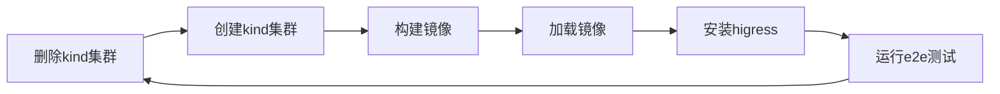
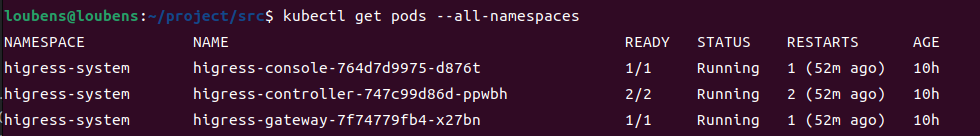
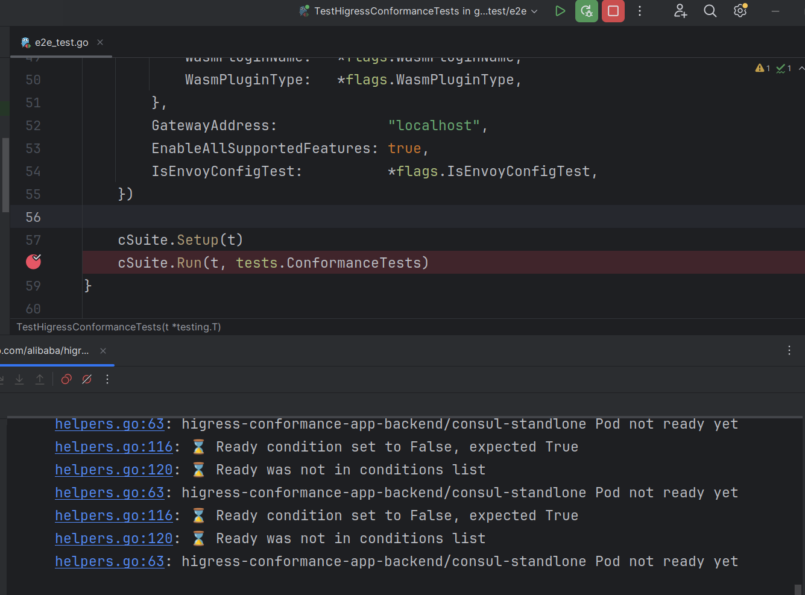
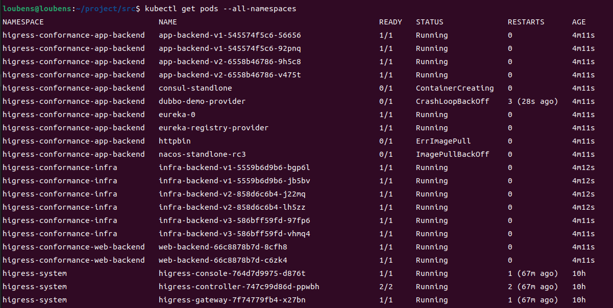
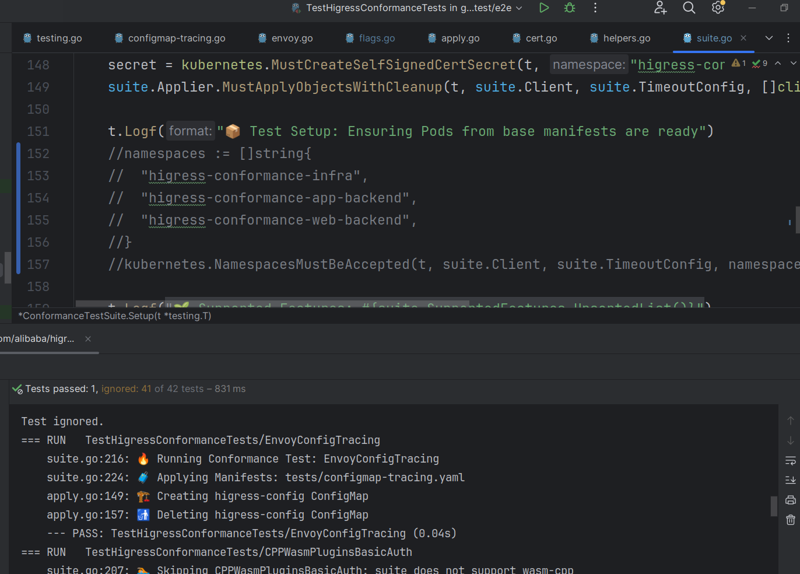

## 起因

e2e测试是一种端到端的测试，它可以模拟用户的真实操作，从而检验整个系统是否能够正常运行。在Higress中，e2e测试的流程大致如下：



在开发的过程中，我们需要频繁的进行e2e测试，但是每次都要重新构建镜像、加载镜像、安装higress、运行e2e测试，这样的过程非常耗时，因此我们需要一个快速的方法来完成e2e测试。
另外makefile命令不支持debug功能，我们也需要一个方法来实现debug功能。

## 实现
### make命令优化

以运行插件测试为例，其make命令如下：

```makefile
.PHONY: higress-wasmplugin-test
higress-wasmplugin-test: $(tools/kind) delete-cluster create-cluster docker-build kube-load-image install-dev-wasmplugin run-higress-e2e-test-wasmplugin delete-cluster
```

开发者首次运行环境可先删除最后一个`delete-cluster`的操作，第二次运行e2e测试的时候可以删除前面的操作，只保留`run-higress-e2e-test-wasmplugin`的操作，这样就可以减少很多时间。

然而make命令不支持添加到goland里面实现debug功能，运行出错的时候也不方便定位问题，更推荐使用下面这个方法。

### Goland完成e2e测试

- e2e测试之前的准备

根据各自的需求来定制环境，如果测试环境中需要用到higress的controller、gateway等组件，需要提前本地安装好环境，安装教程可参考[这里](https://higress.io/zh-cn/docs/user/quickstart/)。

使用helm安装好higress后，可以使用如下命令来查看higress的pod是否正常运行：

```shell
kubectl get pods --all-namespaces
```

显示结果如下图所示：



都显示Running状态，说明higress已经正常运行。

- e2e的flag修改

在`test/e2e/conformance/utils/flags`目录下，有一个`flags.go`文件，里面定义了e2e测试的flag：

```go
var (
    IngressClassName     = flag.String("ingress-class", "higress", "Name of IngressClass to use for tests")
    ShowDebug            = flag.Bool("debug", false, "Whether to print debug logs")
    CleanupBaseResources = flag.Bool("cleanup-base-resources", true, "Whether to cleanup base test resources after the run")
    SupportedFeatures    = flag.String("supported-features", "", "Supported features included in conformance tests suites")
    ExemptFeatures       = flag.String("exempt-features", "", "Exempt Features excluded from conformance tests suites")
    IsWasmPluginTest     = flag.Bool("isWasmPluginTest", false, "Determine if run wasm plugin conformance test")
    WasmPluginType       = flag.String("wasmPluginType", "GO", "Define wasm plugin type, currently supports GO, CPP")
    WasmPluginName       = flag.String("wasmPluginName", "", "Define wasm plugin name")
    IsEnvoyConfigTest    = flag.Bool("isEnvoyConfigTest", false, "Determine if run envoy config conformance test")
)
```
可临时修改这些flag的初始值，也可以在Goland编辑器中定义启动参数，例如设置`IsWasmPluginTest`为true可只运行wasm插件的e2e测试。

修改好flag之后，我们就可以在Goland中通过debug的方式运行e2e测试。可先在如下位置添加一个断点，等待e2e环境准备完毕：



e2e测试在前期环境准备的过程中会创建一些namespace并启动一些pod，可以手动查看一下pod的启动情况。



在这张图里面，除了我们提前安装好的higress组件之外，还有一些其他的pod，这些pod是e2e测试过程中创建的，如果有些pod在本地e2e测试中用不到，可手动修改代码来减少前期环境的准备时间。

> 注意：如果设置了cleanup-base-resources为false，那么e2e测试结束之后，这些pod不会被删除，但是重启的时候会报错，例如：
> ```
> Pod "consul-standlone" is invalid: spec: Forbidden: pod updates may not change fields other than `spec.containers[*].image`, `spec.initContainers[*].image`, `spec.activeDeadlineSeconds`, `spec.tolerations` (only additions to existing tolerations) or `spec.terminationGracePeriodSeconds` (allow it to be set to 1 if it was previously negative)
> ```

> 建议设置为true，每次测试完需要等待pod的销毁，然后重新测试，这些过程一般很快，也可以修改代码来减少一些pod的创建。

- e2e测试环境优化

例如只需要higress环境，而不需要`higress-conformance-infra`,`higress-conformance-app-backend`等namespace环境，可以手动在如下几行代码里添加注释，来跳过这些环境的创建，然后测试中只用到了higress的组件：



在这里，我只需要运行`EnvoyConfigTracing`的Test测试，它只跟higress有关，注释掉了其他namespace的准备环境，可以看到e2e测试不到1s就结束了。

如果需要其他namespace的环境，而不需要nacos/consul等环境，可以在suite的New方法里找到以下代码块，根据需要进行注释：

```go
// apply defaults
if suite.BaseManifests == nil {
	suite.BaseManifests = []string{
		"base/manifests.yaml",
		"base/consul.yaml",
		"base/eureka.yaml",
		"base/nacos.yaml",
		"base/dubbo.yaml",
	}
}
```

解决好e2e测试的环境相关问题，我们就可以在Goland里添加自己想要的断点，来debug测试用例了。
