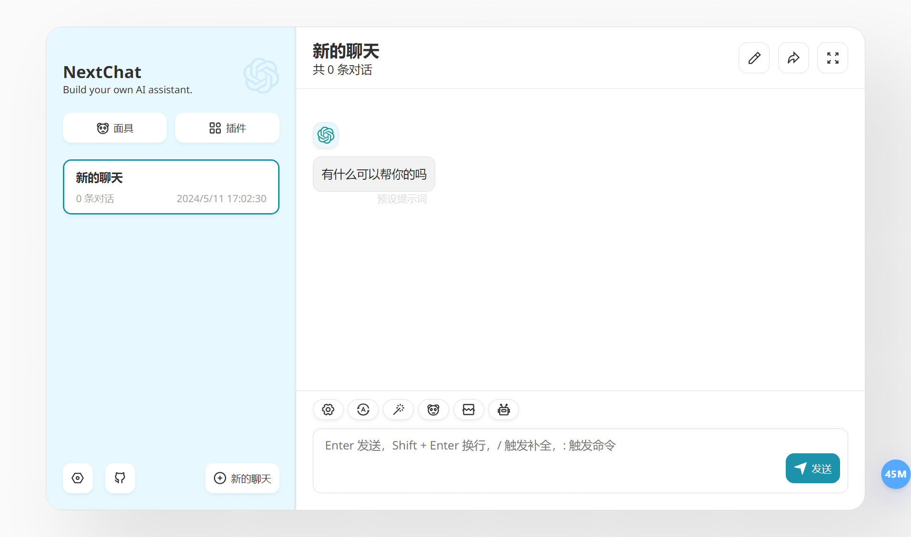
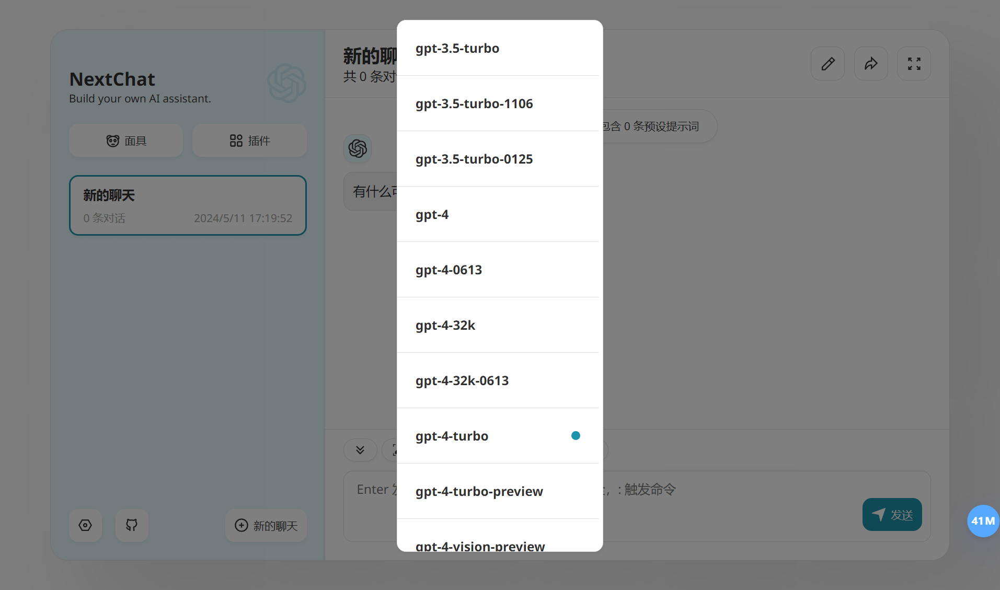
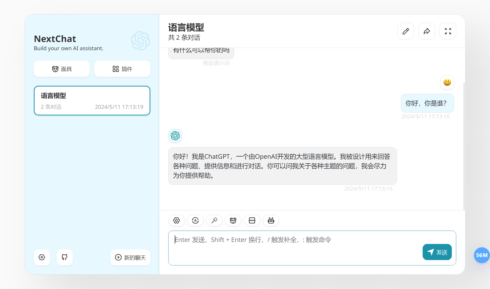

## 引子

现在 AI 大模型的发展如火如荼，OpenAI 的 ChatGPT 和阿里云的通义千问作为全球领先的大模型服务，使用者众多。今天闲来无事，我就想对比一下这两个服务的能力。而且正好在本文写作的前几天，5 月 9 日，[阿里云正式发布了通义千问 2.5，并开源了通义千问 1100 亿参数模型。](https://mp.weixin.qq.com/s/hU5YDkjiAsAYl8h2akl14Q)。那么本次测试我们就来测试一下 ChatGPT 中最高级的模型 GPT-4-Turbo 和通义千问 2.5 对应的 Qwen-Max 模型。

## ChatGPT vs 通义千问

在本次测试中，我们会向两个大模型分别提出相同的问题，看看它们会如何回答。同时也请各位猜猜哪些回答来自 ChatGPT，而哪些又来自通义千问。我们会在文末揭晓答案。

1. 创意故事讲述
问题：
请讲述一个涉及时间旅行的短故事，主角是一位带着宠物猫进行时空穿越的中国科学家。

2. 想象力挑战
问题：
如果某天科技发达到可以让我们与书中角色对话，你会选择哪位角色，为什么？请模拟一段对话。

3. 解决难题
问题：
描述一种新发明，它能解决全球变暖问题，但它的工作原理基于目前科学无法解释的现象。

4. 情感智能
问题：
如果一个人感到孤独，你作为AI会如何安慰他/她？请给出具体的对话实例。

5. 逻辑谜题
问题：
提出一个逻辑谜题，解答既要求逻辑推理，同时还需要一定的创造力。

<!-- 


 -->

大家觉得它们回答的怎么样呢？能不能看出来哪些回答实际是出自通义千问之“口”呢？

## 测试应用介绍

看完上面这些对话截图，不知道各位是否想知道这个测试应用到底是什么，以及它又是如何同时支持 ChatGPT 和通义千问两个大模型服务提供商的呢？下面我就来为大家介绍一下。

这个测试软件的界面部分来自于 [NextChat (ChatGPT Next Web)](https://github.com/ChatGPTNextWeb/ChatGPT-Next-Web)。它是一个可以私有化部署的 ChatGPT 网页应用，目前支持对接 OpenAI、Azure OpenAI、Google Gemini Pro 和 Anthropic Claude 这些服务提供商。

看了对 NextChat 的介绍，大家会发现，“它并不支持对接通义千问啊！你不会根本就没测通义千问吧？”那当然不会了。说到对接通义千问，那就轮到我们的 Higress 出场了。

Higress 是基于阿里内部的 Envoy Gateway 实践沉淀、以开源 Istio + Envoy 为核心构建的云原生 API 网关。基于 Envoy 提供的 Wasm 扩展能力，Higress 近期推出了 AI 服务代理插件。这一插件可以统一各种大模型服务提供商对外暴露的不同接口契约，对外以 OpenAI API 的接口契约对外提供服务。通过调整路由规则和插件配置，用户可以很方便的在不同的大模型服务提供商之间进行切换。

虽然被称作云原生网关，但 Higress 不仅能在 K8s 中部署，它还可以以单一容器配合配置文件的形式运行。而本次测试就利用了 Higress 的这一能力。接下来我们就来看看这个测试平台具体是如何搭建起来的。

## 测试平台搭建

**第一步：**创建一个名为 `docker-compose.yml` 的文件，并填入以下内容：

> 注意：
> 1. `YOUR_DASHSCOPE_API_KEY` 需要替换为你自己的通义千问的 API Key；
> 2. `/path-to-local-config-folder` 需要替换为一个本地可以用来保存配置文件的目录路径。

```yaml
version: '3.9'

networks:
  higress-net:
    external: false

services:
  higress:
    image: higress-registry.cn-hangzhou.cr.aliyuncs.com/higress/all-in-one:1.3.6
    environment:
      - MODE=gateway
      - CONFIG_TEMPLATE=ai-proxy
      - DEFAULT_AI_SERVICE=qwen
      - DASHSCOPE_API_KEY=YOUR_DASHSCOPE_API_KEY
    networks:
      - higress-net
    ports:
      - "8080:8080/tcp"
      - "8001:8001/tcp"
    volumes:
      - /path-to-local-config-folder:/data
    restart: always
  nextchat:
    image: yidadaa/chatgpt-next-web
    environment:
      - OPENAI_API_KEY=unused
      - BASE_URL=http://higress:8080
    networks:
      - higress-net
    ports:
      - "3000:3000/tcp"
    restart: always
```

**第二步：**在命令行中运行以下命令，启动 docker compose 项目：

```bash
docker compose -p higress-ai up -d
```

**第三步：**在浏览器里访问 http://localhost:3000/，打开 NextChat 页面；



**第四步：**点击对话输入框工具栏最右侧的模型设置按钮，将模型切换为 `gpt-4-turbo` 并关闭窗口。



**完成！**现在你就可以与 AI 进行对话了。



按照上面文件进行配置，默认和你对话的将是通义千问。如果想切换到OpenAI ChatGPT，只需要将文件中的 `DEFAULT_AI_SERVICE=qwen` 修改为 `DEFAULT_AI_SERVICE=openai`，并添加 OpenAI 的 API key 配置，然后重新启动 docker compose 项目即可。

```yaml
# 以上配置省略
  higress:
    image: higress-registry.cn-hangzhou.cr.aliyuncs.com/higress/all-in-one:1.3.6
    environment:
      - MODE=gateway
      - CONFIG_TEMPLATE=ai-proxy
      - DEFAULT_AI_SERVICE=openai
      - OPENAI_API_KEY=YOUR_OPENAI_API_KEY
# 以下配置省略
```

```bash
docker compose -p higress-ai down
docker compose -p higress-ai up -d
```

整个流程是不是很简单呢？欢迎各位也在本地尝试一下。

## Higress AI 代理插件介绍

从上面的搭建流程来看，Higress AI 代理插件可以很方便的让 AI 对话应用直接对接通义千问等接口契约不同的大模型服务。除了通义千问和 ChatGPT 之外，这个插件还支持 Azure OpenAI 和月之暗面（Moonshot）等大模型服务提供商，并且支持配置一个外部文件地址作为聊天上下文，可以用来快速搭建一个个人 AI 助理服务。

整个插件使用 Go 语言进行开发，充分利用了 Proxy Wasm SDK 提供的各种逻辑注入点来对请求和响应标头和数据进行修改，以实现统一的 AI 服务网关功能，例如：注入 API key、注入上下文提示词、接口契约格式转换等。尤其是在对接通义千问的时候，由于它使用的接口契约不同，所以插件需要实现对应的数据模型转换逻辑。现在 AI 代理插件已经完全支持使用 OpenAI 协议来流式返回通义千问的响应数据。

插件配置示例：

```yaml
apiVersion: extensions.higress.io/v1alpha1
kind: WasmPlugin
metadata:
  annotations:
    higress.io/wasm-plugin-title: AI Proxy
  labels:
    higress.io/resource-definer: higress
    higress.io/wasm-plugin-built-in: "false"
    higress.io/wasm-plugin-category: custom
    higress.io/wasm-plugin-name: ai-proxy
    higress.io/wasm-plugin-version: "0.0.1"
  name: ai-proxy-0.0.1
  namespace: higress-system
spec:
  defaultConfig: {}
  defaultConfigDisable: true
  matchRules:
  - config:
      provider:
        type: qwen
        apiToken: YOUR_DASHSCOPE_API_KEY
        protocol: openai # 如果要继续使用通义千问本来的接口契约，可以将这里改为 "original"
        modelMapping:
          '*': "qwen-turbo"
          'gpt-3': "qwen-turbo"
          'gpt-35-turbo': "qwen-plus"
          'gpt-4-turbo': "qwen-max"
    configDisable: false
    ingress:
    - qwen
  - config:
      provider:
        type: azure
        apiToken: YOUR_AZURE_OPENAI_API_KEY
        azureServiceUrl: https://YOUR_RESOURCE_NAME.openai.azure.com/openai/deployments/YOUR_DEPLOYMENT_NAME/chat/completions?api-version=2024-02-01
    configDisable: false
    ingress:
    - azure-openai
  - config:
      provider:
        type: openai
        apiToken: YOUR_OPENAI_API_KEY
    configDisable: false
    ingress:
    - openai
  - config:
      provider:
        type: moonshot
        apiToken: YOUR_MOONSHOT_API_KEY
        modelMapping:
          '*': "moonshot-v1-8k"
          'gpt-3': "moonshot-v1-8k"
          'gpt-35-turbo': "moonshot-v1-32k"
          'gpt-4-turbo': "moonshot-v1-128k"
    configDisable: false
    ingress:
    - moonshot
  phase: UNSPECIFIED_PHASE
  priority: "100"
  url: oci://higress-registry.cn-hangzhou.cr.aliyuncs.com/plugins/ai-proxy:0.0.1
```

如果大家有任何需求，也可以对这个插件进行二次开发，比如对接新的大模型服务，自定义 system prompt 等等。同时也欢迎大家把自己开发的功能贡献给社区，造福所有 Higress 的用户。

此外，由中国科学院软件研究所“开源软件供应链点亮计划”发起并长期支持的暑期开源活动“开源之夏”正在进行中。Higress 也有两个与 AI 相关的项目参与其中，分别是“实现基于向量相似度实现LLM结果召回的WASM插件”和“基于AI网关实现AI模型的轻量化部署”。欢迎各位在校同学积极报名参与。详情可查看开源之夏的 [Higress 社区页面](https://summer-ospp.ac.cn/org/orgdetail/1f8ea42c-86c9-46b8-b1f5-344de5741ef0)。

## 答案揭晓

最后，我们来揭晓前面问题的答案。不知道各位猜对了吗？

<!-- 


 -->