# Higress 集成 Skywalking 可观测性探索

[Higress](https://higress.io/zh-cn/) 一个遵循开源Ingress/Gateway API标准，提供流量调度、服务治理、安全防护三合一的高集成、易使用、易扩展、热更新的云原生API网关。

[Skywalking](https://skywalking.apache.org/) 是一个开源的可观测平台，用于从服务和云原生基础设施收集，分析， 聚合及可视化数据。

[Httpbin](https://github.com/2456868764/httpbin) 是基于 Gin 开发，用于快速测试基于云原生微服务可观测性和流量管理等功能。

本文介绍 Higress 集成 Skywalking 实现可观测性，主要内容涉及整体架构、Skywalking 调用链路跟踪原理、Higress 架构、业务应用集成 Skywalking、本地测试环境搭建、Higress 配置、应用安装、调用链路跟踪配置以及 Higress gateway 指标和监控面板。

这次可观测性探索相关 manifests [下载地址](https://gitcode.net/-/snippets/3612) 

## 一、整体架构图

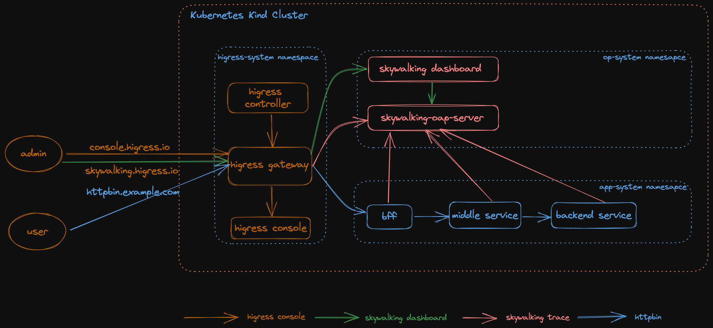

整体包含四大块内容：
- Higress 组件：    higress-gateway, higress-console, higress-controller
- Skywalking 组件： skywalking dashboard ui, skywalking aop server
- 业务应用组件：     bff, middle service, backend service
- Ingress 组件：    skywalking.higress.io, httpbin.example.com

## 二、Skywalking 调用链路跟踪原理

SkyWalking为服务(service)，服务实例(service instance)，以及端点(endpoint)提供了可观测能力。

- 服务(service)：表示对请求提供相同行为的一组工作负载。在使用打点代理或 SDK 的时候，可以定义服务的名字。
- 服务实例(Service Instance)：一组工作负载中的每一个工作负载称为一个实例。
- 端点(Endpoint)： 对于特定服务所接收的请求路径，如 HTTP 的 URI 路径和 gRPC 服务的类名 + 方法签名。
- 进程（Process）： 操作系统进程. 在某些场景下，一个服务实例和进程不是一一对应， 在k8s部署下，一个POD对应多个进程。

### Skywalking 整体架构

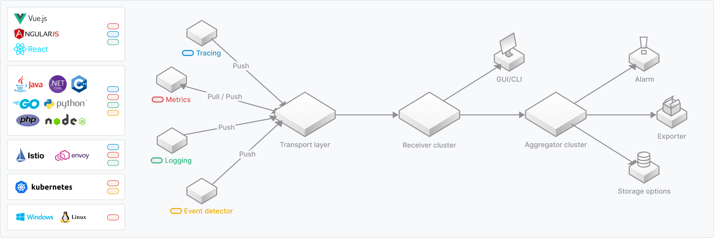

主要由四个核心组件组成：

- 探针: 探针用于收集监测数据包括指标，链路跟踪，日志和事件
- 数据接收和聚合: 平台后端支持数据聚合，数据分析以及驱动数据流从探针到用户界面的处理
- 存储: 通过开放接口支持后端存储系统支持ElasticSearch, H2, MySQL, TiDB, BanyanDB等
- UI:  一个定制化的Web系统，用户可以可视化查看和管理 SkyWalking 数据

### 分布式链路追踪原理分析

1. 分布式链路介绍

分布式链路追踪是记录来源于用户请求在各个系统或者服务中所传播的路径。

> A distributed trace, more commonly known as a trace, records the paths taken by requests (made by an application or end-user) as they propagate through multi-service architectures, like microservice and serverless applications.

分布式链路追踪图示如下：

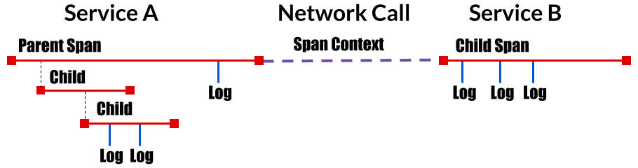

2. Skywalking 分布式链路追踪

主要包含四个内容：

- Trace: 一个完整的链路由多个 Segment 组成
- Segment: 一个请求在一个进程内的轨迹
- Span: 一个请求在某个进程里的一个组件逻辑内的轨迹, 有 Entry Span， Local Span 和 Exit Span 三类
- Span context: 跨进程或者服务 Trace 传递，这里讨论 http 传递头 sw8

基本组件图示如下：

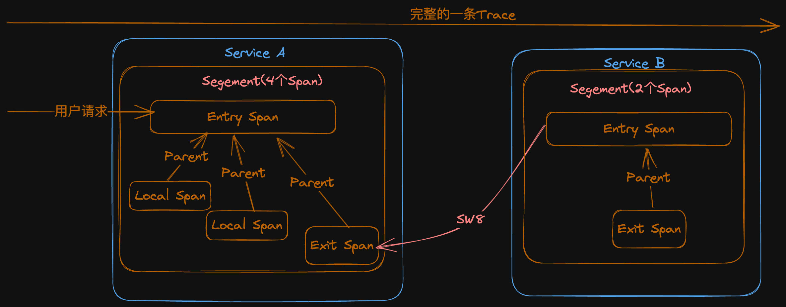

从上图可以看出：

- 一个 Trace 内的所有 span 的 Trace ID 是相同的
- 一个 Segment 中有一个 EntrySpan，是 Segment 内其他 Span 的根 Parent
- 后一个 Segment的 Entryspan 总是与前一个 Segment 中的某个 ExitSpan 关联

3. Skywalking Trace 的数据协议

具体数据协议参考 [Skywalking Trace Data Protocol](https://skywalking.apache.org/docs/main/next/en/api/trace-data-protocol-v3/), 这里主要讲一下 sw8 格式和组成。

sw8 格式: XXXXX-XXXXX-XXXX-XXXX，以 - 分割。
样例: 1-MzYzMzM1NDctNTc0YS00MzZlLTgzNWEtNTY1YTQyNzk3YTY3-ZWQ3ODA2ZjYwNTI0MTFlZWE5ZDdmZTFhNTA5YTRmYTk=-1-bWlkZGxl-bWlkZGxlLTZmNGRkN2JmNmMtcWJ4cm0=-L0dFVC9zZXJ2aWNl-aHR0cDovL2JhY2tlbmQv

具体内容如下：

- 采样标记(Sample):  0 或者 1， 0 表示不采样 1 表示采样
- 跟踪ID(Trace ID): 字符(BASE64 编码)
- 父Sengment ID (Parent trace segment ID): 字符(BASE64 编码)
- 父 Span ID（Parent span ID): 整型
- 父服务名称(Parent service): 字符(BASE64 编码)
- 父服务实例(Parent service instance): 字符(BASE64 编码)
- 父Endpoint(Parent endpoint): 字符(BASE64 编码)
- 目标地址：字符(BASE64 编码)

## 三、Higress 架构

Higress是基于阿里内部的Envoy Gateway实践沉淀、以开源 Istio + Envoy 为核心构建的下一代云原生网关，实现了流量网关 + 微服务网关 + 安全网关三合一的高集成能力，深度集成Dubbo、Nacos、Sentinel等微服务技术栈，能够帮助用户极大的降低网关的部署及运维成本且能力不打折；

在标准上全面支持 Ingress与 Gateway API，积极拥抱云原生下的标准API规范；

同时，Higress Controller也支持Nginx Ingress平滑迁移，帮助用户零成本快速迁移到Higress。

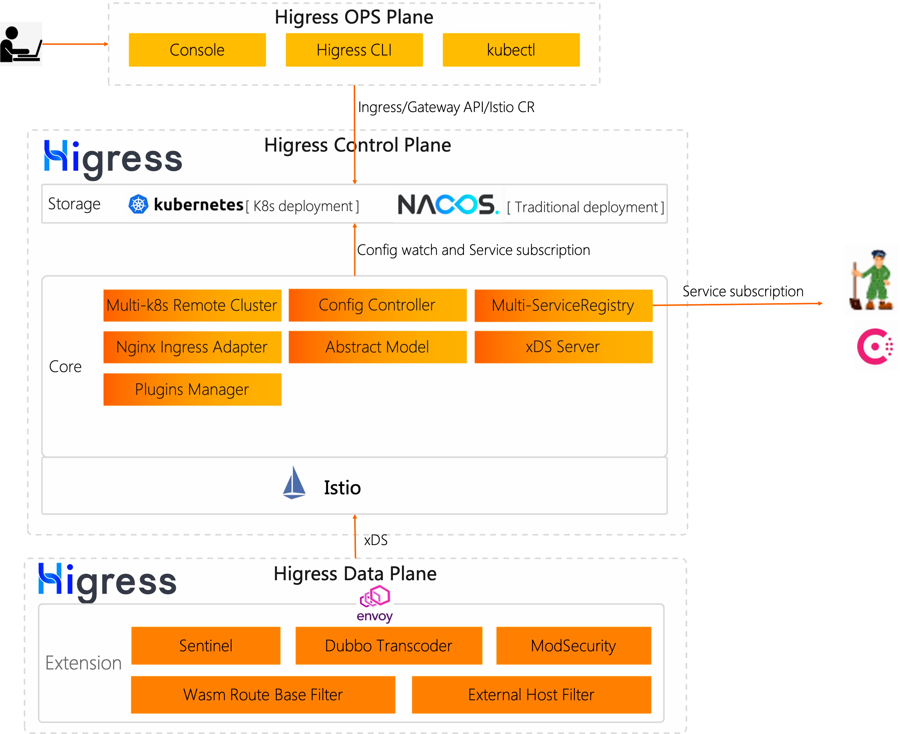

## 四、业务应用集成 Skywalking

业务应用通过与 [go2sky](https://github.com/SkyAPM/go2sky) 项目集成 SkyWalking 监控 Golang 应用程序，主要通过 Gin middleware 和 Http 请求手动埋点。

1、集成 Gin middleware
```golang
func middleware(engine *gin.Engine, tracer *go2sky.Tracer) gin.HandlerFunc {
	if engine == nil || tracer == nil {
		return func(c *gin.Context) {
			c.Next()
		}
	}
	return func(c *gin.Context) {
		if strings.HasPrefix(c.Request.URL.String(), skipProbPrefix) || strings.HasPrefix(c.Request.URL.String(), skipMetricsPrefix) {
			c.Next()
			return
		}
		span, ctx, err := tracer.CreateEntrySpan(c.Request.Context(), getOperationName(c), func(key string) (string, error) {
			return c.Request.Header.Get(key), nil
		})
		if err != nil {
			c.Next()
			return
		}
		span.SetComponent(componentIDGINHttpServer)
		span.Tag(go2sky.TagHTTPMethod, c.Request.Method)
		span.Tag(go2sky.TagURL, c.Request.Host+c.Request.URL.Path)
		span.SetSpanLayer(agentv3.SpanLayer_Http)

		c.Request = c.Request.WithContext(ctx)

		c.Next()

		if len(c.Errors) > 0 {
			span.Error(time.Now(), c.Errors.String())
		}
		span.Tag(go2sky.TagStatusCode, strconv.Itoa(c.Writer.Status()))
		span.End()
	}
}

func getOperationName(c *gin.Context) string {
	return fmt.Sprintf("/%s%s", c.Request.Method, c.FullPath())
}

```

2、Http请求手动埋点

```golang
func traceHttpCall(c *gin.Context, req *http.Request, url string, fn func(req *http.Request) (*http.Response, error)) (*http.Response, error) {
	tracer := go2sky.GetGlobalTracer()
	if tracer == nil {
		resp, err := fn(req)
		return resp, err
	}

	reqSpan, err := go2sky.GetGlobalTracer().CreateExitSpan(c.Request.Context(), "invoke", url, func(headerKey, headerValue string) error {
		req.Header.Set(headerKey, headerValue)
		return nil
	})
	
	reqSpan.SetComponent(2)
	reqSpan.SetSpanLayer(v3.SpanLayer_Http)
	resp, err2 := fn(req)
	reqSpan.Tag(go2sky.TagHTTPMethod, http.MethodGet)
	reqSpan.Tag(go2sky.TagURL, url)
	reqSpan.End()
	return resp, err2

}
```


## 五、本地测试环境搭建

1. 本地安装 kubectl, kind, helm

可以参考 Higress [快速开始](https://higress.io/zh-cn/docs/user/quickstart)安装 kubectl, kind。
helm 安装参考[安装文档](https://helm.sh/zh/docs/intro/install/)

2. 安装 higress 和 istio CRD

可以参考 higress [快速开始](https://higress.io/zh-cn/docs/user/quickstart) 和 [安装部署](https://higress.io/zh-cn/docs/ops/deploy-by-helm) 来部署，这里需要安装  Istio CRD。

下面是一个参考安装命令:

```bash
helm install higress -n higress-system --set global.onlyPushRouteCluster=false --set higress-core.skywalking.enabled=true  --set higress-core.skywalking.service.address=skywalking-oap-server.op-system.svc.cluster.local  --set higress-core.skywalking.service.port=11800 higress.io/higress
```


3. 部署 Skywalking，业务应用和 Ingress

```shell
$ export KUBECONFIG=${HOME}/.kube/config_higress
$ kubectl apply -f skywalking.yaml
$ kubectl apply -f app.yaml
$ kubectl apply -f ingress.yaml
```

检查 POD 运行状态和 Ingress 状态

```shell
$ export KUBECONFIG=${HOME}/.kube/config_higress

$ kubectl get pods -n higress-system 

NAME                                         READY   STATUS    RESTARTS   AGE
higress-console-6f554978dc-cclg7             1/1     Running   0          100m
higress-console-grafana-7495766db4-4flq5     1/1     Running   0          131m
higress-console-prometheus-6d7bdccfb-hxtsq   1/1     Running   0          131m
higress-controller-689c5b965f-7wsmt          2/2     Running   0          131m
higress-gateway-59966b45d9-z7ltd             1/1     Running   0          131m

$ kubectl get pods -n op-system

NAME                                        READY   STATUS    RESTARTS   AGE
skywalking-oap-dashboard-65f496ccc9-dr96l   1/1     Running   0          99m
skywalking-oap-server-859694656b-p8vcq      1/1     Running   0          99m

$ kubectl get pods -n app-system

NAME                       READY   STATUS    RESTARTS   AGE
backend-6b9549bc64-f98tr   1/1     Running   0          99m
backend-6b9549bc64-x2btl   1/1     Running   0          99m
bff-766967f8db-8ght7       1/1     Running   0          99m
bff-766967f8db-gflbh       1/1     Running   0          99m
middle-6f4dd7bf6c-qdjqj    1/1     Running   0          99m
middle-6f4dd7bf6c-stzf4    1/1     Running   0          99m

$ kubectl get svc -n app-system

NAME      TYPE        CLUSTER-IP      EXTERNAL-IP   PORT(S)   AGE
backend   ClusterIP   10.96.179.140   <none>        80/TCP    99m
bff       ClusterIP   10.96.121.62    <none>        80/TCP    99m
middle    ClusterIP   10.96.55.8      <none>        80/TCP    99m

$ kubectl get ingress -n higress-system

NAME                         CLASS     HOSTS                   ADDRESS   PORTS   AGE
httpbin                      higress   httpbin.example.com               80      8s
skywalking-dashboard         higress   skywalking.higress.io             80      8s
```

4. 测试 Higress Console, Skywalking Dashboard, Bff 服务

1）编辑 /etc/hosts 文件添加以下三个域名

```shell
127.0.0.1 skywalking.higress.io
127.0.0.1 httpbin.example.com
```
2）打开 higress-gateway 端口转发
```shell
$ export KUBECONFIG=${HOME}/.kube/config_higress
$ kubectl -n higress-system port-forward service/higress-gateway 8080:80
$ kubectl -n higress-system port-forward service/higress-console 18080:8080
```
3）通过浏览器打开访问上面三个域名

Higress 控制台: [http://127.0.0.1:8080](http://127.0.0.1:18080)。首次访问控制台时需要先初始化管理员用户。初始化完成后使用对应的用户名密码登录即可。

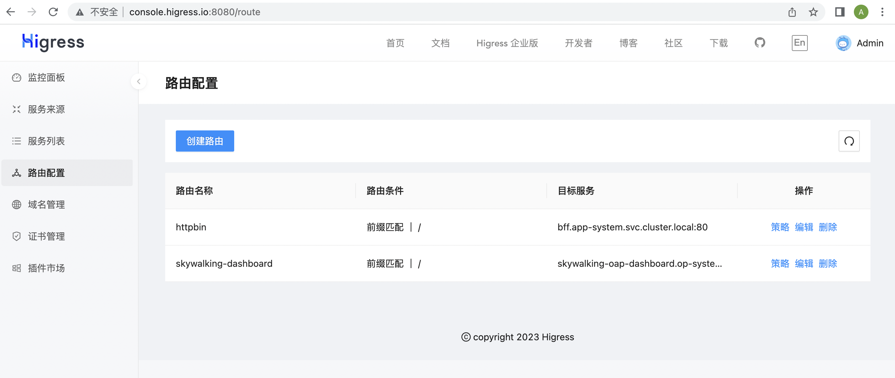

Skywalking Dashboard: http://skywalking.higress.io:8080

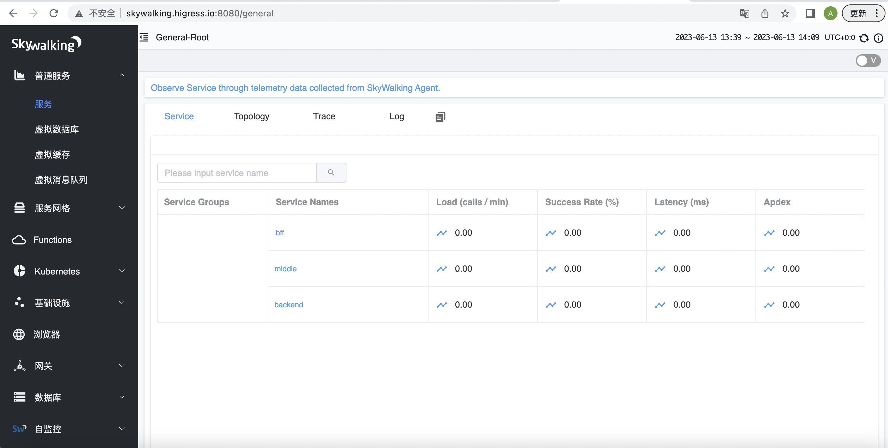

Bff 服务： http://httpbin.example.com:8080/hostname

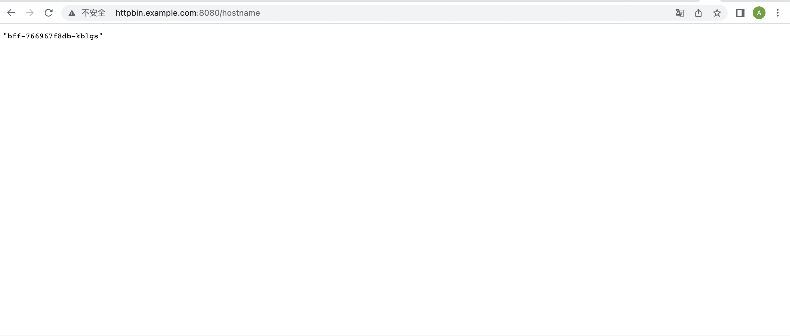


## 六、Higress 集成 Skywalking 调用链路跟踪配置

通过修改 Higress configmap 全局配置 higress-config 来激活 Higress 集成 Skywalking 调用链路跟踪。

```shell
$ export KUBECONFIG=${HOME}/.kube/config_higress
$ kubectl edit configmap higgress-config -n higress-system
```

在 data 下增加 higress 配置项然后保存，具体配置内容如下：

```shell
data:
  higress: |-
    tracing:
      enable: true
      sampling: 100
      timeout: 500
      skywalking:
       service: skywalking-oap-server.op-system.svc.cluster.local
       port: 11800
```

## 七、Skywalking 链路跟踪

### 运行压测脚本
```shell
for i in $(seq 1 1000)
do
    curl -v -H "Host:httpbin.example.com" http://127.0.0.1:8080/hostname
    curl -v -H "Host:httpbin.example.com" http://127.0.0.1:8080/
    curl -v -H "Host:httpbin.example.com" http://127.0.0.1:8080/service?services=middle,backend
done
```


### 调用 bff 服务 /service 接口来模拟调用链路

```shell
curl -v -H "Host:httpbin.example.com" http://127.0.0.1:8080/service?services=middle,backend
```

部分返回响应体情况如下：

```json
{
  "args": {
  },
  "form": {
  },
  "headers": {
    "accept-encoding": "gzip",
    "sw8": "1-MzYzMzM1NDctNTc0YS00MzZlLTgzNWEtNTY1YTQyNzk3YTY3-ZWQ3ODA2ZjYwNTI0MTFlZWE5ZDdmZTFhNTA5YTRmYTk=-1-bWlkZGxl-bWlkZGxlLTZmNGRkN2JmNmMtcWJ4cm0=-L0dFVC9zZXJ2aWNl-aHR0cDovL2JhY2tlbmQv",
    "sw8-correlation": "",
    "user-agent": "Go-http-client/1.1",
    "x-httpbin-trace-host": "bff-766967f8db-jwn2g/middle-6f4dd7bf6c-qbxrm/backend-6b9549bc64-8twnx",
    "x-httpbin-trace-service": "bff/middle/backend",
    "x-request-id": "e5a1b250-ebe3-931d-91d7-90e3ee2fc867"
  },
  "method": "GET",
  "origin": "",
  "url": "/",
  "envs": {
    "NODE_NAME": "higress-worker2",
    "PATH": "/usr/local/sbin:/usr/local/bin:/usr/sbin:/usr/bin:/sbin:/bin",
    "POD_IP": "10.244.1.7",
    "POD_NAME": "backend-6b9549bc64-8twnx",
    "POD_NAMESPACE": "app-system",
    "SERVICE_ACCOUNT": "backend",
    "SERVICE_NAME": "backend",
    "VERSION": "v1"
  },
  "host_name": "backend-6b9549bc64-8twnx",
  "body": ""
}
```

响应头中和调用链路跟踪相关有如下：

```shell
"sw8": "1-MzYzMzM1NDctNTc0YS00MzZlLTgzNWEtNTY1YTQyNzk3YTY3-ZWQ3ODA2ZjYwNTI0MTFlZWE5ZDdmZTFhNTA5YTRmYTk=-1-bWlkZGxl-bWlkZGxlLTZmNGRkN2JmNmMtcWJ4cm0=-L0dFVC9zZXJ2aWNl-aHR0cDovL2JhY2tlbmQv",
"x-httpbin-trace-host": "bff-766967f8db-jwn2g/middle-6f4dd7bf6c-qbxrm/backend-6b9549bc64-8twnx",
"x-httpbin-trace-service": "bff/middle/backend",
```

其中：
- sw8:  Skywalking 用于跟踪的 Http Header
- x-httpbin-trace-host: 调用链路经过 POD_NAME
- x-httpbin-trace-service: 调用链路经过 SERVICE_NAME

在 Skywalking dashboard 中查看如下：
- 服务截图

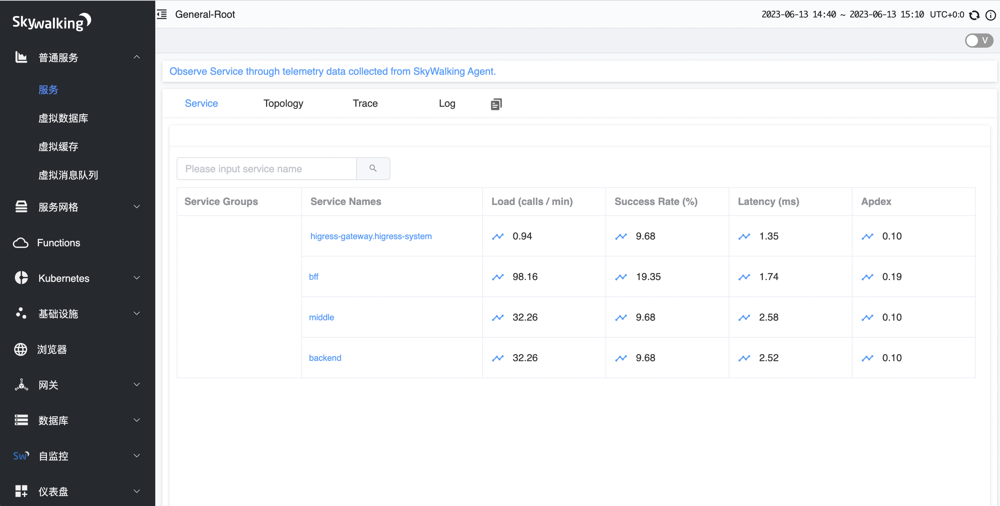

- 调用链路截图

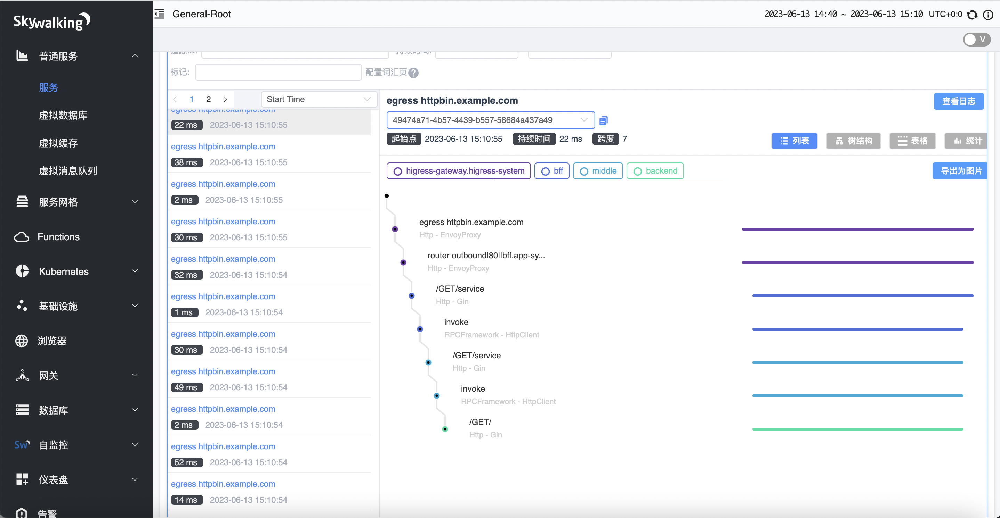

- 调用链路拓扑截图

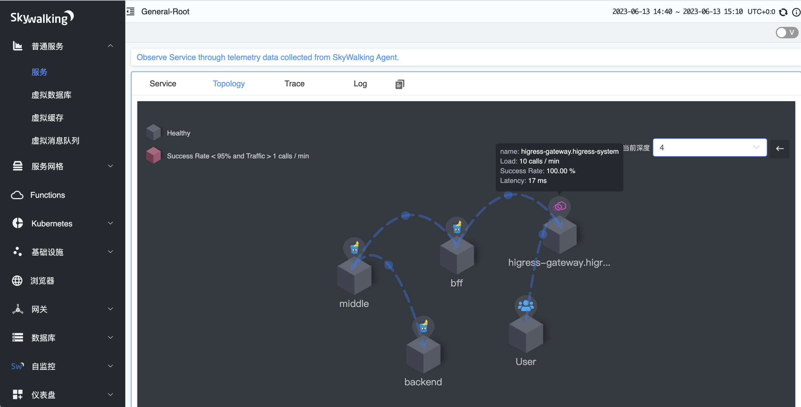

## 八、Higress gateway 指标和监控面板

可以通过度量各个组件的性能指标，例如响应时间、吞吐量、错误率、资源使用率等指标来了解系统的状态和性能。

指标数据包含指标名称，指标标签，和指标值，下面是 envoy_cluster_upstream_cx_total upstream（总连接数）部分指标数据，

其中 envoy_cluster_upstream_cx_total 是指标名称，cluster_name 是指标标签，16 是指标值。
```shell
# TYPE envoy_cluster_upstream_cx_total counter
envoy_cluster_upstream_cx_total{cluster_name="outbound|80||bff.app-system.svc.cluster.local"} 16
```

Higress 指标数据大体可以分为三类:
- Downstream 下游: 指标与外来的连接/请求有关，主要由侦听器，HTTP连接管理器等
- UpStream 上游: 指标与外向的连接/请求有关，主要由连接池，路由器，过滤器，熔断等
- Server 负载: 指标信息记录 Higress gateway 服务器实例的负载等

Higress 指标数据类型主要有三类:
- Counter: 无符号整数，只会增加而不会减少。例如，总请求
- Gauge: 增加和减少的无符号整数。例如，当前活动的请求
- Histogram: 作为指标流的一部分的无符号整数，然后由收集器聚合以最终产生汇总的百分位值(percentile，即平常说的 P99/P50/Pxx)。例如，Upstream 响应时间

通过以下命令可以获取 Higress gateway 支持的指标和类型

```shell
$ export HIGRESS_GATEWAY_POD=$(kubectl get pods -l app=higress-gateway -o 'jsonpath={.items[0].metadata.name}' -n higress-system)
$ kubectl exec "$HIGRESS_GATEWAY_POD"  -n higress-system  -- curl -sS http://127.0.0.1:15020/stats/prometheus | grep "# TYPE"  
```
部分指标内容如下：
```shell
...
# TYPE envoy_cluster_upstream_cx_total counter
# TYPE envoy_cluster_upstream_cx_tx_bytes_total counter
# TYPE envoy_cluster_upstream_flow_control_backed_up_total counter
# TYPE envoy_cluster_upstream_flow_control_drained_total counter
# TYPE envoy_cluster_upstream_flow_control_paused_reading_total counter
# TYPE envoy_cluster_upstream_flow_control_resumed_reading_total counter
# TYPE envoy_cluster_upstream_internal_redirect_failed_total counter
# TYPE envoy_cluster_upstream_internal_redirect_succeeded_total counter
# TYPE envoy_cluster_upstream_rq counter
# TYPE envoy_cluster_upstream_rq_101 counter
# TYPE envoy_cluster_upstream_rq_200 counter
# TYPE envoy_cluster_upstream_rq_201 counter
# TYPE envoy_cluster_upstream_rq_301 counter
# TYPE envoy_cluster_upstream_rq_302 counter
# TYPE envoy_cluster_upstream_rq_304 counter
# TYPE envoy_cluster_upstream_rq_401 counter
# TYPE envoy_cluster_upstream_rq_404 counter
# TYPE envoy_cluster_upstream_rq_cancelled counter
# TYPE envoy_cluster_upstream_rq_completed counter
# TYPE envoy_cluster_upstream_rq_maintenance_mode counter
# TYPE envoy_cluster_upstream_rq_max_duration_reached counter
# TYPE envoy_cluster_upstream_rq_pending_failure_eject counter
# TYPE envoy_cluster_upstream_rq_pending_overflow counter
# TYPE envoy_cluster_upstream_rq_pending_total counter
# TYPE envoy_cluster_upstream_rq_per_try_idle_timeout counter
# TYPE envoy_cluster_upstream_rq_per_try_timeout counter
# TYPE envoy_cluster_upstream_rq_retry counter
# TYPE envoy_cluster_upstream_rq_retry_backoff_exponential counter
# TYPE envoy_cluster_upstream_rq_retry_backoff_ratelimited counter
# TYPE envoy_cluster_upstream_rq_retry_limit_exceeded counter
# TYPE envoy_cluster_upstream_rq_retry_overflow counter
# TYPE envoy_cluster_upstream_rq_retry_success counter
# TYPE envoy_cluster_upstream_rq_rx_reset counter
# TYPE envoy_cluster_upstream_rq_timeout counter
# TYPE envoy_cluster_upstream_rq_total counter
# TYPE envoy_cluster_upstream_rq_tx_reset counter
...
# TYPE envoy_http_downstream_cx_total counter
# TYPE envoy_http_downstream_cx_tx_bytes_total counter
# TYPE envoy_http_downstream_cx_upgrades_total counter
# TYPE envoy_http_downstream_flow_control_paused_reading_total counter
# TYPE envoy_http_downstream_flow_control_resumed_reading_total counter
# TYPE envoy_http_downstream_rq counter
# TYPE envoy_http_downstream_rq_completed counter
# TYPE envoy_http_downstream_rq_failed_path_normalization counter
# TYPE envoy_http_downstream_rq_header_timeout counter
# TYPE envoy_http_downstream_rq_http1_total counter
# TYPE envoy_http_downstream_rq_http2_total counter
# TYPE envoy_http_downstream_rq_http3_total counter
# TYPE envoy_http_downstream_rq_idle_timeout counter
# TYPE envoy_http_downstream_rq_max_duration_reached counter
# TYPE envoy_http_downstream_rq_non_relative_path counter
# TYPE envoy_http_downstream_rq_overload_close counter
# TYPE envoy_http_downstream_rq_redirected_with_normalized_path counter
# TYPE envoy_http_downstream_rq_rejected_via_ip_detection counter
# TYPE envoy_http_downstream_rq_response_before_rq_complete counter
# TYPE envoy_http_downstream_rq_rx_reset counter
# TYPE envoy_http_downstream_rq_timeout counter
# TYPE envoy_http_downstream_rq_too_large counter
# TYPE envoy_http_downstream_rq_total counter
# TYPE envoy_http_downstream_rq_tx_reset counter
# TYPE envoy_http_downstream_rq_ws_on_non_ws_route counter
...
```

具体指标定义参考如下：
- [cluster manager](https://www.envoyproxy.io/docs/envoy/latest/configuration/upstream/cluster_manager/cluster_stats)
- [http connection manager](https://www.envoyproxy.io/docs/envoy/latest/configuration/http/http_conn_man/stats)
- [listeners](https://www.envoyproxy.io/docs/envoy/latest/configuration/listeners/stats)
- [server](https://www.envoyproxy.io/docs/envoy/latest/configuration/observability/statistics)


如何查看 Higress 指标数据：

- 通过 http://127.0.0.1:18080/dashboard 查看 Higress gateway 监控面板
- 通过 Skywalking Dashboard 查看 Higress gateway 监控数据

通过 Skywalking Dashboard 查看 Higress gateway 监控数据部分截图如下：

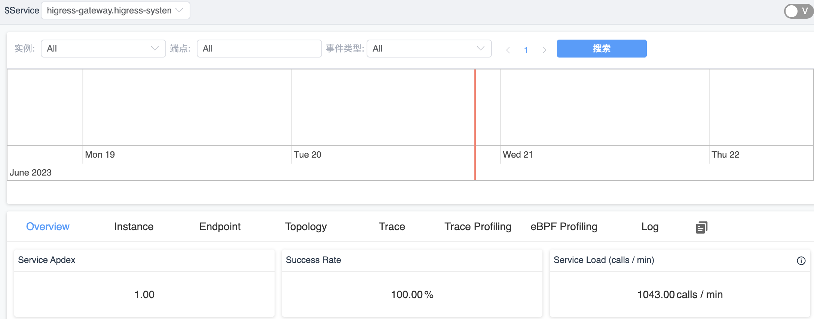
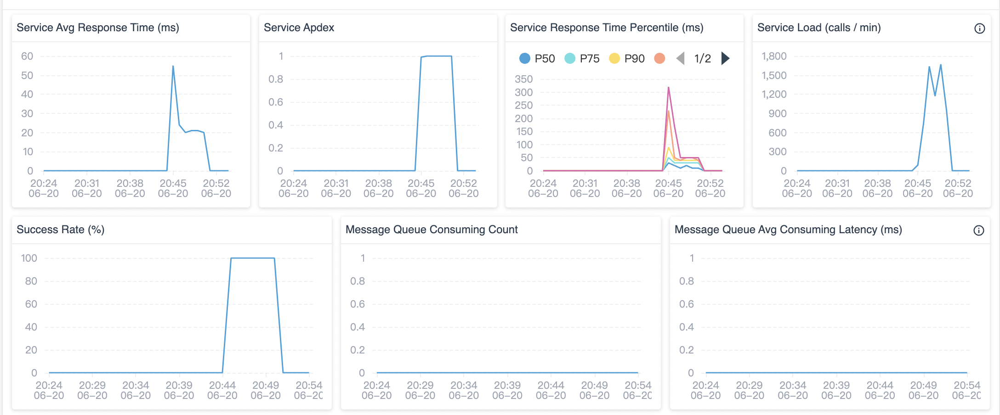
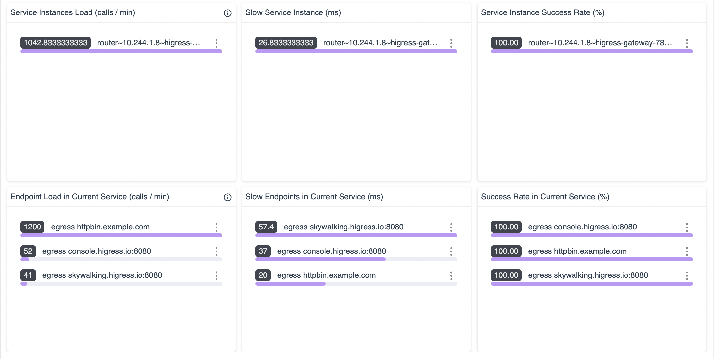

## 参考文档
- https://istio.io/latest/docs/tasks/observability/distributed-tracing/skywalking/
- http://peter.bourgon.org/blog/2017/02/21/metrics-tracing-and-logging.html
- https://skywalking.apache.org/docs/main/next/en/api/x-process-propagation-headers-v3/
- https://skywalking.apache.org/docs/main/next/en/api/trace-data-protocol-v3/


