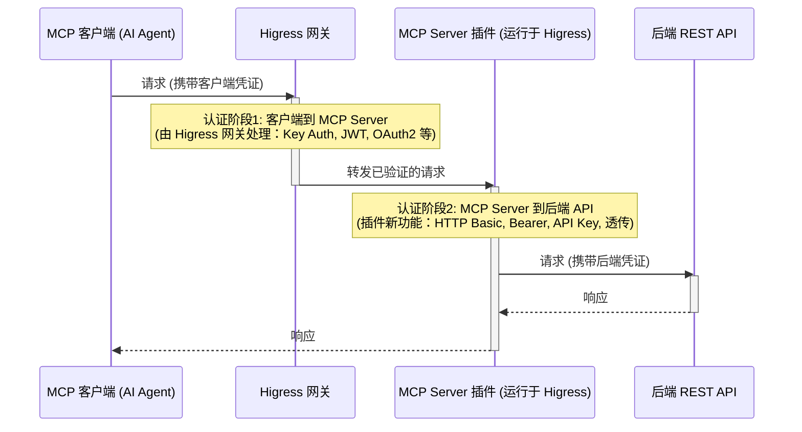

Higress 作为一款强大的 AI 原生 API 网关，致力于铺设 AI 与现实世界之间最短、最安全、最具成本效益的连接路径。其核心能力之一便是支持将现有的 OpenAPI 规范无缝转换为 MCP Server，让 AI 能够快速、便捷地调用各类存量 API 服务。借助 Higress，企业和开发者可以瞬间将其宝贵的 API 资产转化为 AI 可用的远程 MCP Server，从而极大地加速 AI 应用的落地和创新。

当通过 Higress 托管的 MCP Server 集成 AI 与外部服务时，通常需要考虑两个主要的认证阶段：

1.  **客户端到 MCP Server 的认证**：这是指 MCP 客户端（例如 AI Agent）对 Higress 网关上托管 MCP Server 的端点进行的认证。Higress 为此阶段提供了强大的网关级认证机制，例如 Key Auth、JWT Auth 以及 OAuth2 支持。这些现有的 Higress 功能确保只有授权的客户端才能访问您的 MCP Server。

2.  **MCP Server 到后端 API 的认证**：一旦授权客户端调用某个 MCP 工具，MCP Server 插件本身可能需要向该工具所代理的最终后端 REST API 进行认证。

本次发布聚焦于对**第二阶段**的重大增强：在 Higress MCP Server 插件内部为其与后端 REST API 的通信提供全面的 API 认证能力。此更新使开发者能够通过在 MCP Server 插件中进行配置，并遵循 OpenAPI 标准，以灵活且健壮的机制管理凭证和认证流程，从而安全地集成更广泛的后端服务。

下图阐释了这两个认证阶段：



## 本次新增核心认证功能概览 (针对 MCP Server 到后端 API)

此版本引入了多项核心功能来管理 API 认证：

1.  **可重用认证方案**：在服务器层面定义通用的认证方法（HTTP Basic、HTTP Bearer、API Key）。
2.  **工具特定的后端认证**：将已定义的认证方案应用于单个工具，指定 MCP Server 在调用后端 REST API 时应如何进行自我认证。
3.  **透明凭证透传**：允许 MCP 客户端（例如 AI 助手）提供的凭证安全地透传至后端 API。
4.  **灵活的凭证管理**：支持在方案级别设置默认凭证，并允许为特定工具覆盖这些默认凭证。

接下来，让我们深入了解如何利用这些功能。

## 定义认证方案 (`server.securitySchemes`)

您现在可以在 MCP Server 配置的 `server` 层级定义一组 `securitySchemes`。这种方式与 OpenAPI 规范 (OAS3) 中定义安全要求的方法保持一致，使其易于理解和标准化。每个方案代表您的后端 API 可能使用的一种特定认证方法。

目前，Higress MCP Server 插件支持以下方案类型：
*   `http` 配合 `scheme: basic` (HTTP Basic 认证)
*   `http` 配合 `scheme: bearer` (HTTP Bearer 令牌认证)
*   `apiKey` 配合 `in: header` 或 `in: query` (位于 Header 或查询参数中的 API Key)

我们计划在未来的版本中增加对 `oauth2` 和 `openIdConnect` (OIDC) 方案的支持，从而进一步扩展您可以安全集成的 API 范围。

**`securitySchemes` 配置字段**:

| 字段                | 类型   | 描述                                                                                                 |
|---------------------|--------|------------------------------------------------------------------------------------------------------|
| `id`                | string | 此认证方案的唯一标识符。                                                                               |
| `type`              | string | 认证方案的类型 (例如, `http`, `apiKey`)。                                                              |
| `scheme`            | string | 对于 `type: http`，指定具体方案 (例如, `basic`, `bearer`)。                                            |
| `in`                | string | 对于 `type: apiKey`，指定 API Key 的位置 (例如, `header`, `query`)。                                     |
| `name`              | string | 对于 `type: apiKey`，指定 Header 或查询参数的名称。                                                      |
| `defaultCredential` | string | 此方案使用的默认凭证 (例如, Basic 认证的 "user:pass"，Bearer 令牌的 token 值，API Key 的密钥本身)。 |

**示例**:

```yaml
server:
  name: my-secure-api-server
  securitySchemes:
    - id: backendBasicAuth
      type: http
      scheme: basic
      defaultCredential: "service_user:p@$$wOrd"
    - id: backendBearerToken
      type: http
      scheme: bearer
      defaultCredential: "your_static_bearer_token_for_backend"
    - id: backendApiKeyHeader
      type: apiKey
      in: header
      name: X-Internal-ApiKey
      defaultCredential: "secret_backend_api_key"
```

## 为后端 API 调用应用认证 (`requestTemplate.security`)

定义认证方案后，您可以将其应用于 MCP Server 向后端 REST API 发出的请求。这在每个工具的 `requestTemplate` 中进行配置：

-   `requestTemplate.security.id`: 引用在 `server.securitySchemes` 中定义的方案的 `id`。
-   `requestTemplate.security.credential`: (可选) 允许您为此特定工具的后端调用覆盖方案中的 `defaultCredential`。

**示例**:

```yaml
tools:
  - name: fetch-sensitive-data
    description: "从需要 Bearer 令牌的后端服务获取敏感数据。"
    args: # ...
    requestTemplate:
      url: "https://api.internal.com/data"
      method: GET
      security:
        id: backendBearerToken # 使用 'backendBearerToken' 方案
        # credential: "override_token_for_this_tool_if_needed" # 如果需要，可为此工具覆盖令牌
```

## 透明凭证透传

最强大的新增功能之一是能够将来自客户端请求（例如，从 AI Agent 到 MCP Server）的凭证透明地传递到后端 API 调用（MCP Server 到实际的 REST API）。当后端 API 需要 AI 客户端拥有的用户特定认证时，此功能非常宝贵。

**工作原理**:

1.  **客户端认证方案定义**：MCP Server 需要知道客户端如何进行自我认证。这也通过 `server.securitySchemes` 中的一个方案来定义。
2.  **工具级安全配置 (`tools[].security`)**:
    *   `id`: 引用*客户端*在调用此 MCP 工具时应使用的认证方案。MCP Server 将使用此方案来提取客户端的凭证。
    *   `passthrough: true`: 此标志启用透传机制。
3.  **后端认证**: 如上所述的 `requestTemplate.security` 定义了*透传凭证*将如何应用于后端 API 调用。

**示例**:

假设一个 AI 客户端使用用户特定的 JWT Bearer 令牌调用您的 MCP 工具。您希望使用相同的令牌调用后端服务。

```yaml
server:
  name: user-data-passthrough-server
  securitySchemes:
    - id: clientUserBearer # 客户端传入 Bearer 令牌的方案
      type: http
      scheme: bearer
    - id: backendServiceBearer # 后端 API 的方案 (也是 Bearer, 但可以不同)
      type: http
      scheme: bearer
      # 如果总是依赖透传，则此处无需 defaultCredential

tools:
  - name: get-user-profile
    description: "使用客户端提供的令牌获取用户个人资料。"
    security: # 客户端如何向此 MCP 工具进行认证的配置
      id: clientUserBearer   # MCP Server 期望客户端使用 Bearer 令牌
      passthrough: true     # 启用透传
    args: # ...
    requestTemplate:
      url: "https://api.user-profiles.com/me"
      method: GET
      security: # MCP Server 如何向后端 API 进行认证的配置
        id: backendServiceBearer # 透传的令牌将作为 Bearer 令牌发送到后端。
```

**工作流程**:

1.  AI 客户端调用 `get-user-profile` 工具，并提供一个 `Authorization: Bearer <user_jwt_token>` 请求头。
2.  Higress MCP Server 根据 `tools[].security.id: clientUserBearer` 提取 `<user_jwt_token>`。来自客户端的原始 `Authorization` 请求头被移除。
3.  由于设置了 `passthrough: true`，`<user_jwt_token>` 被指定为用于后端调用的凭证。
4.  然后，MCP Server 使用 `requestTemplate.security.id: backendServiceBearer` 中定义的方案来格式化此 `<user_jwt_token>` 并将其发送到 `https://api.user-profiles.com/me` 端点 (即，它发送 `Authorization: Bearer <user_jwt_token>`)。

**关于透传的重要说明**:
*   当 `passthrough: true` 时，`requestTemplate.security.credential` 中指定的任何 `credential` 都将被忽略。
*   MCP Server 会智能地从客户端请求中提取核心凭证部分（例如，从 "Bearer token" 中提取 token，从 "Basic base64value" 中提取 base64 部分），然后再进行透传。

## 带来的益处

这些新的认证功能提供了：

-   **增强的安全性**：妥善保护与后端服务的交互。
-   **更高的灵活性**：支持各种常见的认证模式。
-   **简化的集成**：更容易与具有不同安全要求的 API 集成。
-   **无缝的用户上下文传播**：透明地使用客户端提供的凭证进行后端调用，实现个性化的 API 交互。

我们相信这些增强功能将显著改善使用 Higress 和 MCP Server 构建的 AI 驱动应用程序的安全状况和集成能力。

## 通过 `openapi-to-mcp` 简化配置

为了进一步简化配置过程，最新版本的 `openapi-to-mcp` 工具（项目地址：[GitHub](https://github.com/higress-group/openapi-to-mcpserver)）现已支持将包含 `securitySchemes` 定义的 OpenAPI 文档直接转换为此 MCP Server 插件配置。如果您的 OpenAPI 规范已经描述了其安全要求，该工具可以生成相应的 `server.securitySchemes` 并将其链接到合适的工具，从而显著减少手动配置的工作量。

## 开始使用

如果您使用开源版 Higress 请更新您的 Higress MCP Server 插件，并参阅 [MCP Server README 文档](https://higress.cn/ai/mcp-server) 获取详细的配置说明和更多示例。

如果您使用企业版 Higress（阿里云 AI 网关），请参考我们的[企业版产品文档](https://help.aliyun.com/zh/api-gateway/ai-gateway/user-guide/mcp-services-management)，我们提供了更易用的产品化封装，并提供全托管免运维的服务，以及99.99%的SLA可用性保障:
 

我们致力于将 Higress 打造成一个强大且开发者友好的 AI 原生 API 网关，能够对接 LLM API、MCP API 和 Agent API。敬请期待更多更新！

