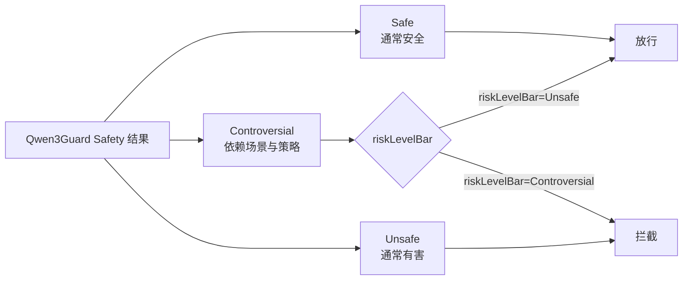
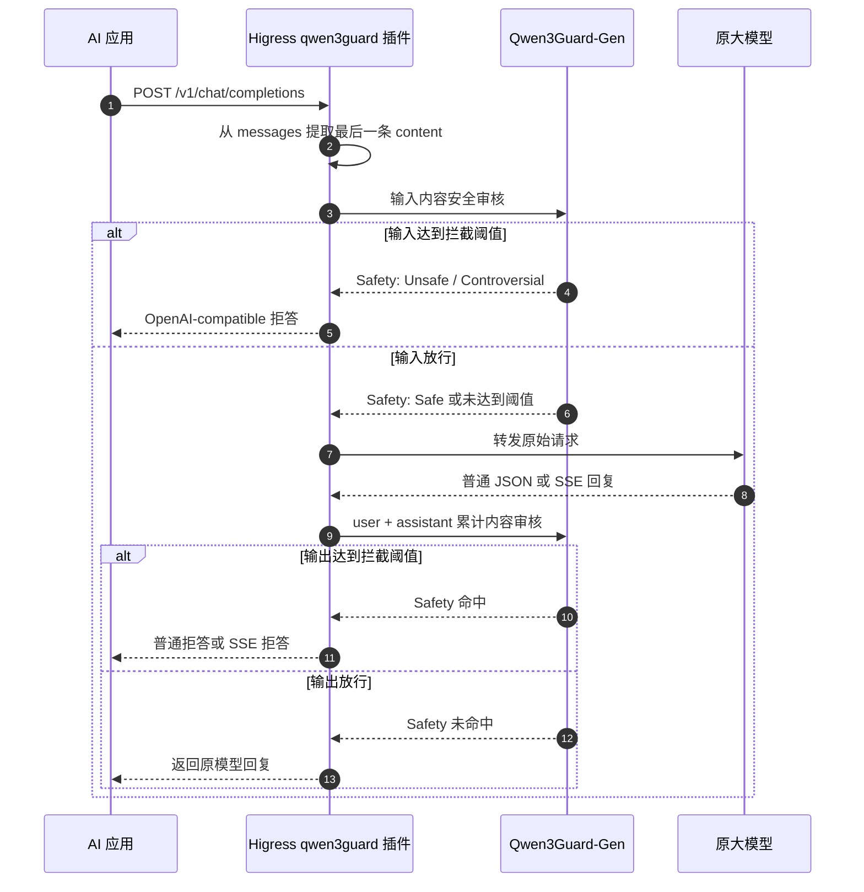
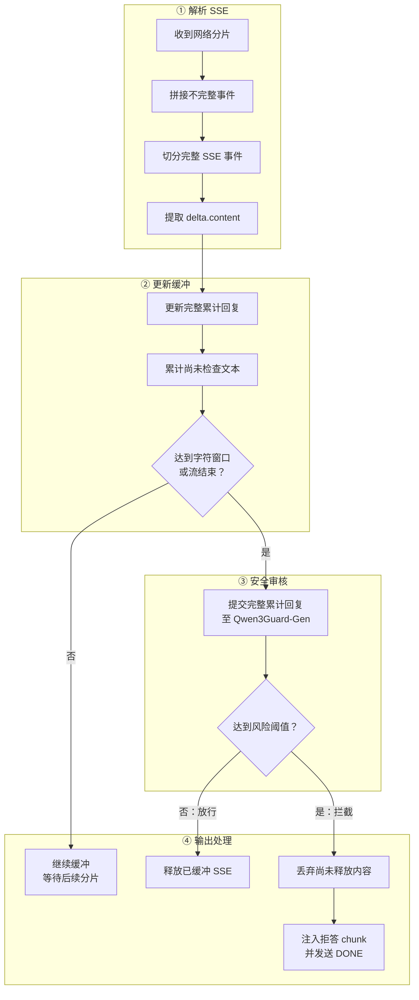
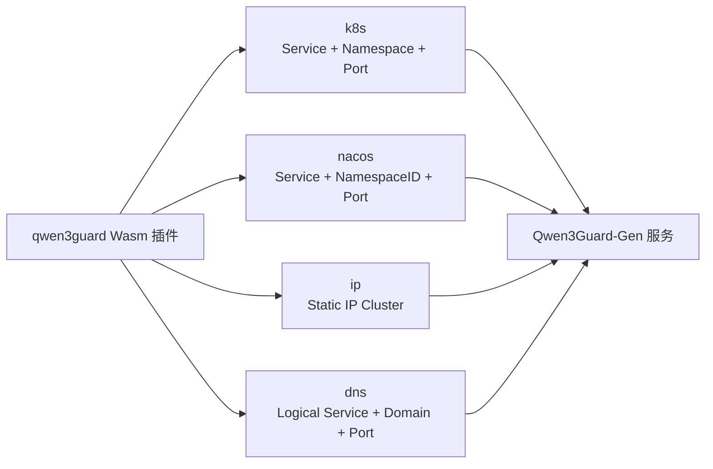
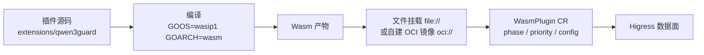
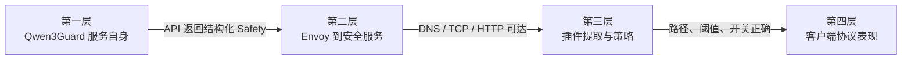
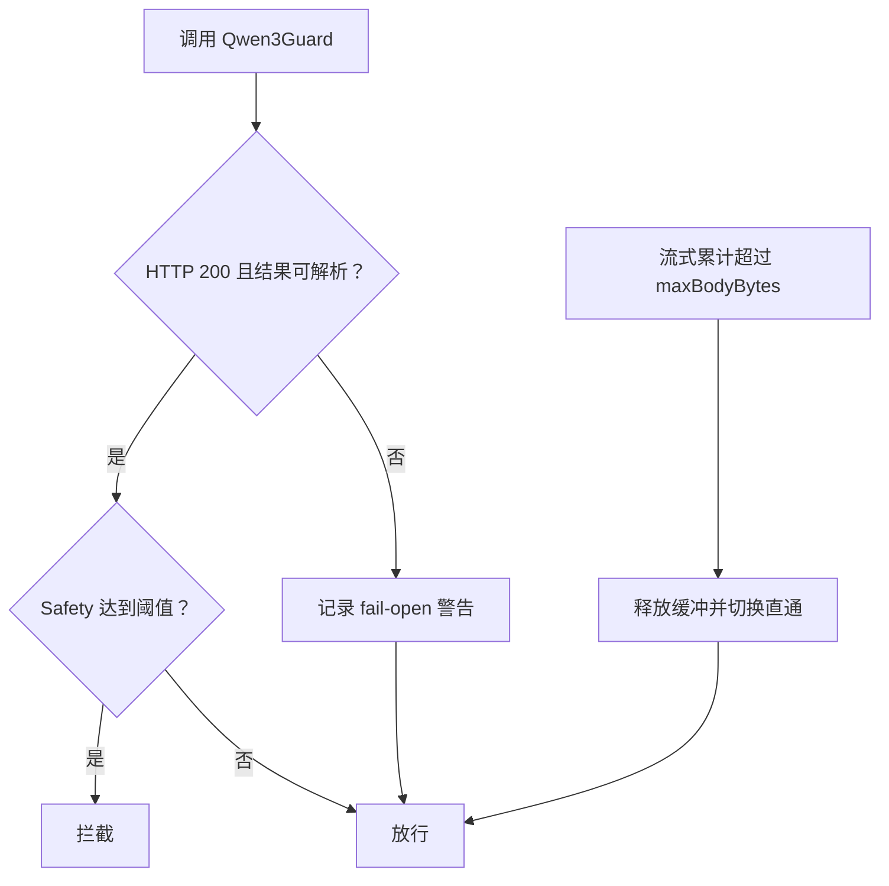

作者：正己

生成式 AI 正在跨越"能不能用"的门槛，走向"如何规模化地安全使用"。

Higress 项目现已以 Wasm 插件形式接入 Qwen3Guard-Gen。三句话说明它做了什么：

+ **业务零改造**：不修改应用代码，不改动上游模型服务，应用继续使用熟悉的 Chat Completions 协议；
+ **输入、输出、流式全覆盖**：在请求进入模型前审核用户输入，在模型返回后审核非流式 JSON 或 SSE 流式输出；
+ **安全模型自托管**：Qwen3Guard 按官方方式独立部署和扩缩容，无需依赖任何云端内容安全服务，风险阈值和拒答文案由网关统一配置。

之所以要把这件事放到网关，是因为风险来源是双向的：既可能来自用户输入，也可能出现在模型输出。如果每个应用各自维护审核 SDK、风险阈值和拒答逻辑，安全策略很快就会散落在多个代码仓库中；一旦模型切换或策略升级，业务还得重复改造。

先用一张图看懂这次集成：


这不是在网关旁边挂一个与流量脱节的安全样例，而是把内容提取、安全外呼、风险决策、流式缓冲和拒答整形，放进请求与响应真正经过的数据面链路。Higress 负责把模型判断转化为网关动作。

## 1. Qwen3Guard 提供判断，Higress 负责执行
根据 [Qwen3Guard 官方仓库](https://github.com/QwenLM/Qwen3Guard)、[官方模型卡](https://huggingface.co/Qwen/Qwen3Guard-Gen-4B)和[技术报告](https://arxiv.org/abs/2510.14276)，Qwen3Guard 是基于 Qwen3 构建的安全审核模型系列，使用超过 119 万条带安全标注的提示词和回复数据训练，提供 0.6B、4B、8B 三种规模，分为两条技术路线：

| 官方模型 | 工作方式 | 本插件是否直接接入 |
| --- | --- | --- |
| Qwen3Guard-Gen | 接收完整用户输入或"输入＋回复"，以生成方式输出结构化安全判断 | **是** |
| Qwen3Guard-Stream | 使用专用分类头和流状态，逐 token 进行安全监测 | **否** |


本插件默认调用 `Qwen/Qwen3Guard-Gen-4B`，原因很直接：Qwen3Guard-Gen 可以通过 vLLM 或 SGLang 暴露 OpenAI-compatible `POST /v1/chat/completions` 接口，与现有 AI 网关协议自然衔接。

Qwen3Guard 输出三级风险：



插件将官方三级结果映射为两档网关策略：

| `riskLevelBar` | 拦截范围 | 适用含义 |
| --- | --- | --- |
| `Unsafe`，默认值 | 仅拦截 `Unsafe` | `Controversial` 按宽松策略放行 |
| `Controversial` | 拦截 `Controversial` 和 `Unsafe` | 将争议内容纳入严格策略 |


Qwen3Guard 官方安全策略覆盖暴力、非暴力违法行为、性内容、个人身份信息、自杀与自伤、不道德行为、政治敏感主题、版权侵权等类别，并在输入审核中包含 Jailbreak 检测。当前插件能够解析 `Safety`、`Categories` 和回复审核中的 `Refusal`，但真正参与放行决策的只有 `Safety` 与 `riskLevelBar`。当前版本尚未实现按类别配置不同动作，本文也不将其宣传为已具备的能力。

官方资料还给出了 119 种语言和方言支持，并报告了英文、中文和多语言安全基准结果。这些是 Qwen3Guard 模型的公开定位，不等于某个具体业务的线上效果承诺；生产接入仍需使用自己的语言分布、真实风险样本和误拦成本完成评估。

## 2. 一次完整调用是怎样被保护的
网关是调用者与模型服务之间的必经路径。把安全控制放在 Higress，多个应用就能复用同一套审核接入与阈值，而不必把逻辑复制到每个业务中。

下面的时序图对应当前代码的真实调用顺序：



### 请求侧：先审核，再决定是否访问原模型
插件默认启用 `checkRequest`。收到请求体后，它按 `maxBodyBytes` 设置缓冲上限，并使用默认 GJSON Path `messages.@reverse.0.content` 取得最后一条消息的 `content`。

提取成功后，插件按照 Qwen3Guard-Gen 官方 Prompt Moderation 形态构造请求：

```json
{
  "model": "Qwen/Qwen3Guard-Gen-4B",
  "messages": [
    {
      "role": "user",
      "content": "<待审核输入>"
    }
  ],
  "max_tokens": 128
}
```

风险达到阈值时，插件直接返回拒答，不再调用原大模型；未达到阈值才恢复请求并继续转发。这样既统一了安全执行点，也避免被拦截的请求继续占用原模型推理资源。

### 响应侧：结合问题与回答共同判断
插件默认也启用 `checkResponse`。对于 HTTP `200` 的非流式响应，它缓冲完整 JSON，通过 `choices.0.message.content` 提取回复，再按官方 Response Moderation 结构提交：

```json
{
  "model": "Qwen/Qwen3Guard-Gen-4B",
  "messages": [
    {
      "role": "user",
      "content": "<原始用户输入>"
    },
    {
      "role": "assistant",
      "content": "<模型回复>"
    }
  ],
  "max_tokens": 128
}
```

只要请求阶段成功取得用户文本，回复审核就会保留"问题＋回答"的对话关系。如果请求文本未提取成功，插件不会编造上下文，而是仅审核 assistant 回复。响应检测只处理 HTTP `200`，其他状态码直接放行；启用响应检测时，插件还会移除请求中的 `Accept-Encoding`，避免压缩响应无法直接提取文本。

## 3. SSE 流式回复如何被审核
AI 对话普遍使用流式输出。当前插件识别 `Content-Type: text/event-stream`，解析 SSE 事件边界和 `data:` 载荷，通过 `choices.0.delta.content` 收集新增文本。



插件维护两份状态：

+ **完整累计回复**：每次检查都把截至当前的完整文本送检；
+ **自上次检查后的新增文本**：达到 `streamBufferChars` 时触发下一次检查。

默认每新增 1000 个 Unicode 字符触发一次检查，字符数按 UTF-8 rune 计算，不是字节数。窗口越小，检查越频繁、待审核内容越少，但 Qwen3Guard 调用次数和重复计算随之增加；窗口越大，调用次数下降，但更多内容会在一次审核前保持缓冲。具体值需要按真实流量、首字延迟和推理资源测试确定。

命中风险后，插件只能丢弃尚未释放的数据并追加拒答 SSE；已经发给客户端的状态码和历史片段无法追回，因此流式拦截时 `denyCode` 不生效。

这里需要再次强调：

> 当前实现是"网关分段缓冲 SSE，并重复调用 Qwen3Guard-Gen 审核累计文本"，不是 Qwen3Guard-Stream 的原生逐 token 分类。
>

官方技术报告指出，Gen 模型反复处理累计文本会产生重复计算；Stream 模型则通过专用分类头和流状态避免重复处理历史 token。两者不能混为同一项性能能力。

## 4. 四种服务发现方式，模型服务独立扩缩容
Qwen3Guard 推理服务不嵌入网关进程。插件通过 Higress Wasm Go SDK 构建 Envoy 外呼 cluster，当前支持四种 `serviceSource`：



| `serviceSource` | 必要信息 | 代码行为 |
| --- | --- | --- |
| `k8s` | `serviceName`、`servicePort`，`namespace` 默认 `default` | 构建 Kubernetes service cluster |
| `nacos` | `serviceName`、`servicePort`、`namespace` | 构建 Nacos service cluster |
| `ip` | `serviceName`、`servicePort` | 构建 Static IP cluster |
| `dns` | `serviceName`、`servicePort`、`domain` | 构建 DNS cluster |


这意味着 Qwen3Guard 可以独立部署和扩缩容，网关只依赖一个可访问的 OpenAI-compatible HTTP 服务。但需要注意："服务已经启动"并不等于"网关数据面已经可达"。DNS、cluster 名称、Kubernetes 命名空间、出口网络、白名单和鉴权，仍需从 Envoy 所在网络验证。

## 5. 安装与启用：编译、挂载、下发配置
Higress 的开源 Wasm 插件由使用者自行编译并挂载，官方不提供预构建的 qwen3guard 插件镜像。整个过程分三步：**编译 Wasm 产物 → 让数据面能取到产物 → 用 WasmPlugin 下发配置**。



### 第一步：编译 Wasm 产物
最简单的方式是本地直接编译，产物为 `main.wasm`：

```bash
cd plugins/wasm-go
PLUGIN_NAME=qwen3guard make local-build
# 产物：plugins/wasm-go/extensions/qwen3guard/main.wasm
```

等价的手工命令：

```bash
cd plugins/wasm-go/extensions/qwen3guard
go test ./...
GOOS=wasip1 GOARCH=wasm go build -buildmode=c-shared -o main.wasm .
```

如果希望固定编译环境，使用仓库提供的容器构建，产物为 `plugin.wasm`：

```bash
cd plugins/wasm-go
PLUGIN_NAME=qwen3guard make build
# 产物：plugins/wasm-go/extensions/qwen3guard/plugin.wasm
```

生产环境建议构建成自己的 OCI 镜像并推送到自有仓库：

```bash
cd plugins/wasm-go
PLUGIN_NAME=qwen3guard \
REGISTRY=<your-registry>/ \
PLUGIN_VERSION=1.0.0 \
make build-push
```

注意 `REGISTRY` 需要以 `/` 结尾，最终镜像地址为 `${REGISTRY}${PLUGIN_NAME}:${PLUGIN_VERSION}`。不指定 `PLUGIN_VERSION` 时，tag 会退化为"构建时间-commit"，不利于回滚和灰度，生产环境应显式指定。

### 第二步：让数据面能取到产物
两条路径，按场景二选一：

| 方式 | `url` 写法 | 适用场景 | 前提 |
| --- | --- | --- | --- |
| 文件挂载 | `file:///opt/plugins/wasm-go/extensions/qwen3guard/plugin.wasm` | 本地开发、自建验证 | Helm 安装时开启 `global.volumeWasmPlugins=true`，把产物放到 gateway 容器对应路径 |
| OCI 镜像 | `oci://<your-registry>/qwen3guard:1.0.0` | 生产部署 | 已执行 `make build-push`，且数据面能拉取该仓库 |


仓库自带的 `make install-dev-wasmplugin` 走的就是文件挂载路径，它会设置 Helm 变量 `global.volumeWasmPlugins=true`，把本地编译产物挂进网关容器，适合开发期快速迭代。

### 第三步：用 WasmPlugin 下发配置
全局启用：

```yaml
apiVersion: extensions.higress.io/v1alpha1
kind: WasmPlugin
metadata:
  name: qwen3guard
  namespace: higress-system
spec:
  phase: UNSPECIFIED_PHASE
  priority: 300
  url: oci://<your-registry>/qwen3guard:1.0.0
  defaultConfig:
    serviceSource: k8s
    serviceName: qwen3guard
    servicePort: 8000
    namespace: ai-security
    requestPath: /v1/chat/completions
    model: Qwen/Qwen3Guard-Gen-4B
    timeoutMs: 3000
    checkRequest: true
    checkResponse: true
    riskLevelBar: Unsafe
```

只对特定 AI 路由生效时，关闭默认配置、改用 `matchRules`，避免非 AI 流量也被缓冲和审核：

```yaml
spec:
  phase: UNSPECIFIED_PHASE
  priority: 300
  url: oci://<your-registry>/qwen3guard:1.0.0
  defaultConfigDisable: true
  matchRules:
    - configDisable: false
      ingress:
        - default/my-ai-route
      config:
        serviceSource: k8s
        serviceName: qwen3guard
        servicePort: 8000
        namespace: ai-security
        riskLevelBar: Unsafe
```

### 执行阶段与优先级：和 ai-proxy 一起用时怎么排序
`phase` 和 `priority` 由 WasmPlugin 资源决定，插件代码本身不声明，因此**必须在 CR 里显式写清**，不要依赖默认值。

规则很简单：阶段先比阶段，同一阶段内 `priority`** 数值越大越先执行**。仓库 e2e 用例里就有依赖这一规则的注释——`custom-response` 用 `priority: 200` 以确保先于 `priority: 100` 的 `basic-auth` 执行。

参考现有 AI 插件的取值：

| 插件 | 阶段 | 优先级 |
| --- | --- | --- |
| `ai-proxy` | 默认阶段 | `100` |
| `ai-statistics` | 默认阶段 | `200` |
| `ai-security-guard` | 默认阶段 | `300` |


因此推荐 qwen3guard 使用**默认阶段 + **`priority: 300`，与同类安全插件保持一致的相对次序。这个取值同时解决了两侧的内容提取问题：

+ **请求侧**：qwen3guard 先于 ai-proxy 执行，看到的是应用发来的原始 OpenAI 格式请求体，默认路径 `messages.@reverse.0.content` 可以直接命中；
+ **响应侧**：Envoy 的响应路径按相反顺序穿过过滤器，qwen3guard 在 ai-proxy 之后执行，看到的是已经被归一化为 OpenAI 格式的响应，默认路径 `choices.0.message.content` 和 `choices.0.delta.content` 同样可以直接命中。

如果调整了相对顺序（例如让 qwen3guard 在 ai-proxy 之后处理请求），就需要同步调整三个 GJSON Path，使其匹配那一层实际看到的报文结构。

### 完整配置字段
```yaml
serviceSource: k8s
serviceName: qwen3guard
servicePort: 8000
namespace: ai-security

requestPath: /v1/chat/completions
apiKey: EMPTY
model: Qwen/Qwen3Guard-Gen-4B
timeoutMs: 3000

checkRequest: true
checkResponse: true

requestContentJsonPath: messages.@reverse.0.content
responseContentJsonPath: choices.0.message.content
streamingResponseContentJsonPath: choices.0.delta.content
streamBufferChars: 1000

riskLevelBar: Unsafe
denyCode: 200
denyMessage: 很抱歉，我无法回答您的问题
maxBodyBytes: 10485760
```

几点注意：三个名称包含 `JsonPath` 的字段实际使用 GJSON Path 语法，不要添加 `$` 前缀。`apiKey` 只填写原始值，插件会自动添加 `Bearer ` 前缀。当前实现未配置密钥时仍使用默认值 `EMPTY`，并发送 `Authorization: Bearer EMPTY`，尚不支持完全省略 Authorization 请求头。

另外，插件产物导出 Proxy-Wasm ABI `0.2.100`，需要使用支持该 ABI 的 Higress 数据面镜像；只支持其他 ABI 版本的标准 Envoy 无法加载。

## 6. 部署安全服务并验证链路
### 用 vLLM 启动 Qwen3Guard-Gen
官方模型卡给出的 OpenAI-compatible 部署方式如下：

```bash
pip install "vllm>=0.9.0"

vllm serve Qwen/Qwen3Guard-Gen-4B \
  --port 8000 \
  --max-model-len 32768
```

建议先直接验证安全服务本身，不要一开始就把所有问题归因于网关：

```bash
curl -sS http://127.0.0.1:8000/v1/chat/completions \
  -H 'Content-Type: application/json' \
  -d '{
    "model": "Qwen/Qwen3Guard-Gen-4B",
    "messages": [
      {
        "role": "user",
        "content": "请介绍一下杭州西湖。"
      }
    ],
    "max_tokens": 128
  }'
```

官方定义的生成内容采用类似以下结构：

```latex
Safety: Safe
Categories: None
```

如果服务实际部署在 Kubernetes、容器或其他机器中，`127.0.0.1:8000` 只代表当前命令所在主机，不能据此推断 Higress 网关已经可达。

### 验证安全输入
```bash
curl -i 'http://<YOUR_GATEWAY>/v1/chat/completions' \
  -H 'Content-Type: application/json' \
  -d '{
    "model": "your-upstream-model",
    "messages": [
      {
        "role": "user",
        "content": "请介绍一下杭州西湖。"
      }
    ],
    "stream": false
  }'
```

预期链路：

```latex
客户端
  → Higress 提取用户输入
  → Qwen3Guard 返回未达到阈值
  → 请求继续到原大模型
  → 回复再次审核
  → 返回原模型结果
```

文章不预设原模型会返回什么内容；能被代码确认的是：未命中阈值时，插件继续转发。

### 验证输入拦截
使用符合组织安全测试规范的风险样本发送相同请求。若 Qwen3Guard 返回 `Safety: Unsafe` 且阈值为 `Unsafe`，原大模型不会被调用，客户端收到插件生成的 Chat Completions 风格拒答：

```json
{
  "object": "chat.completion",
  "model": "from-security-guard",
  "choices": [
    {
      "index": 0,
      "message": {
        "role": "assistant",
        "content": "很抱歉，我无法回答您的问题"
      },
      "finish_reason": "stop"
    }
  ]
}
```

实际响应还包含动态 `id`、`created`、`usage` 和 `logprobs`。默认 `denyCode` 是 `200`，所以客户端不能只靠 HTTP 错误码识别拒答。

### 验证 SSE 流式拦截
```bash
curl -N 'http://<YOUR_GATEWAY>/v1/chat/completions' \
  -H 'Content-Type: application/json' \
  -d '{
    "model": "your-upstream-model",
    "messages": [
      {
        "role": "user",
        "content": "<符合测试规范的流式审核样本>"
      }
    ],
    "stream": true
  }'
```

流式输出命中风险后，插件追加的拒答形态为：

```latex
data: {"object":"chat.completion.chunk","choices":[{"delta":{"role":"assistant","content":"很抱歉，我无法回答您的问题"}}]}

data: {"object":"chat.completion.chunk","choices":[{"delta":{},"finish_reason":"stop"}]}

data: [DONE]
```

上面只保留便于阅读的关键字段；真实事件还包含动态 `id`、`created`、`model`、`index` 和 `logprobs`。

### 可选实践：通过 DNS 接入集群外的 Qwen3Guard
如果安全服务不在 Higress 所在 Kubernetes 集群中，可以使用 `serviceSource: dns`。当前 SDK 生成的 Envoy cluster 名称为：

```latex
outbound|<servicePort>||<serviceName>.dns
```

例如，逻辑服务名使用 `qwen3guard-api`，对应的 ServiceEntry host 应为 `qwen3guard-api.dns`。注意 `serviceName` 中不要再次填写 `.dns`，否则 cluster 名称会变成 `.dns.dns`。

```yaml
apiVersion: networking.istio.io/v1alpha3
kind: ServiceEntry
metadata:
  name: qwen3guard-api
  namespace: higress-system
spec:
  hosts:
    - qwen3guard-api.dns
  ports:
    - name: http
      number: 80
      protocol: HTTP
  resolution: DNS
  endpoints:
    - address: qwen3guard.example.com
      ports:
        http: 80
```

插件侧对应改为 `serviceSource: dns`、`serviceName: qwen3guard-api`、`servicePort: 80`、`domain: qwen3guard.example.com`。这两个对象需要同时正确：ServiceEntry 负责让 Envoy 拥有目标 cluster，插件配置负责选择同名 cluster 并设置实际 HTTP Host。只有域名能在开发机解析，并不能证明网关 Pod 所在网络也能解析和访问。

### 一套不猜测模型结果的验收要点
安全模型对具体样本的判断必须以真实返回为准，文章不预言某句话一定得到哪个标签。可以使用经过审核的测试集，或者在测试环境使用可控的 Qwen3Guard 响应桩，按"模型返回值 → 插件动作"验证网关逻辑：

| 请求形态 | Qwen3Guard 条件 | 插件配置 | 应观察到的动作 |
| --- | --- | --- | --- |
| 非流式请求 | `Safety: Controversial` | `riskLevelBar: Unsafe` | 请求继续访问原模型 |
| 非流式请求 | `Safety: Controversial` | `riskLevelBar: Controversial` | 原模型不被调用，返回普通拒答 |
| 非流式请求 | `Safety: Unsafe` | 任一合法阈值 | 原模型不被调用，返回普通拒答 |
| 非流式响应 | `Safety: Unsafe` | `checkResponse: true` | 原回复被替换为普通拒答 |
| SSE 响应 | 累计文本检查返回 `Unsafe` | `checkResponse: true` | 丢弃未释放数据，追加拒答 SSE 与 `[DONE]` |
| 普通或 SSE | 安全服务超时或非 `200` | 当前 fail-open | 记录警告并放行 |


还有三类边界值得单独覆盖：`Safety` 为未知字符串时应解析失败并 fail-open，而不是把未知标签猜成风险结果；流式累计超过 `maxBodyBytes` 后应释放缓冲并切换直通；上游返回非 `200` 时应跳过输出审核直接放行。完整用例列表见插件 README。

验收时应同时观察客户端响应、原模型是否收到请求、Qwen3Guard 调用次数和 Wasm 警告日志。只看到客户端返回 `200` 不能证明请求一定通过了原模型——因为默认拒答状态码本身也是 `200`。

### 参数怎么调：先理解影响，再用压测决定
代码给出了默认值，但没有宣称默认值适合所有业务。下面列出每个关键参数变化带来的直接工程影响，最终取值应由真实回复长度、并发量、安全服务时延和风险容忍度共同决定：

| 参数 | 当前默认值 | 调小或关闭的影响 | 调大的影响 |
| --- | --- | --- | --- |
| `timeoutMs` | `2000` | 更快进入 fail-open，安全服务可用时间窗口更短 | 能容忍更慢推理，但请求或流式释放等待更久 |
| `streamBufferChars` | `1000` | 更频繁审核，累计文本重复推理次数增加 | 审核次数下降，但单次检查前缓冲文本更多 |
| `maxBodyBytes` | `10485760` | 更早触发流式直通，超长请求或回复更难被完整审核 | 允许更长内容，同时增加单请求潜在缓冲量 |
| `checkRequest` | `true` | 关闭后不拦截用户输入，但为输出审核仍可能读取请求上下文 | 布尔字段，无"调大"含义 |
| `checkResponse` | `true` | 关闭后不缓冲或检查原模型回复 | 布尔字段，无"调大"含义 |
| `riskLevelBar` | `Unsafe` | 改为 `Controversial` 会采用更严格策略 | 仅支持 `Unsafe` 与 `Controversial` 两档 |
| `denyCode` | `200` | 可改成业务约定的其他正整数状态码，仅作用于请求和非流式拦截 | SSE 已经发送状态码后不会受该字段影响 |
| `denyMessage` | 默认中文拒答 | 可替换为应用自己的安全提示 | 只改变返回文案，不改变风险判断 |


推荐的调参顺序是：先确保内容路径与网络链路正确，再确认阈值策略，随后用真实长度分布测试 `streamBufferChars` 和 `maxBodyBytes`，最后在可用性目标下调整 `timeoutMs`。如果一开始同时修改所有参数，出现放行或延迟异常时很难判断是哪一层造成的。

## 7. 上线前检查：从网络到策略逐层确认
建议按"安全服务 → 网关外呼 → 插件策略 → 业务协议"四层逐级检查，避免一开始就用最终业务请求定位所有问题。



+ **安全服务自身**：模型名与实际部署一致，`/v1/chat/completions` 返回 HTTP `200`，`choices[0].message.content` 中存在可解析的 `Safety:`，且 Prompt 与 Response 两种 messages 结构都能处理。
+ **Envoy 到安全服务**：`serviceSource`、`serviceName`、`servicePort` 与实际服务一致，命名空间或 DNS `domain` 正确，并且**从网关所在网络**而不是开发机验证可达；目标服务若配置 IP 白名单，需加入网关实际出口 IP。收到 `401` 或 `403` 至少说明链路已打通，连接超时则优先检查网络和白名单。
+ **插件提取与策略**：三个 GJSON Path 分别能提取输入、非流式回复和 SSE 增量文本；`riskLevelBar` 与业务严格程度一致；`checkRequest`、`checkResponse` 没有被误关；`timeoutMs`、`streamBufferChars`、`maxBodyBytes` 已按真实流量评估。
+ **客户端协议表现**：普通拒答能被现有 Chat Completions 客户端解析，SSE 拒答包含结束 chunk 和 `[DONE]`，客户端可通过拒答内容或 `model: from-security-guard` 识别安全响应；不要依赖 HTTP 非 `200` 判断拦截，因为默认 `denyCode` 就是 `200`。

### 常见故障速查
| 现象 | 与当前实现一致的可能原因 | 优先检查 |
| --- | --- | --- |
| 所有请求都迅速到达原模型 | 外呼 dispatch 失败后 fail-open，或未提取到请求文本 | Wasm 警告日志、GJSON Path、Envoy cluster |
| 插件外呼返回 `503` | 目标 cluster 不存在或后端不可达 | cluster 名称、ServiceEntry、Service、endpoint |
| Qwen3Guard 返回 `401` | `apiKey` 缺失、错误或重复填写 `Bearer ` | 只配置原始密钥，检查服务端鉴权 |
| SSE 一直不向客户端释放 | 尚未达到字符窗口，或安全外呼仍在进行 | `streamBufferChars`、Qwen3Guard 时延、插件日志 |
| `Controversial` 没有拦截 | 阈值仍是默认 `Unsafe` | 将 `riskLevelBar` 设为 `Controversial` 后复测 |
| 返回 HTTP `200` 却是拒答 | 默认 `denyCode` 就是 `200` | 检查响应 `model` 与 assistant 内容 |
| 独立 Envoy 无法加载插件 | 数据面不支持插件要求的 Proxy-Wasm ABI | 使用与当前 Higress 版本匹配的数据面镜像 |


更多故障场景（非流式响应未审核、SSE 超长后不再审核、测试路由收不到请求体回调等）见插件 README 的常见问题章节。

安全配置中可能包含 `apiKey`。不要把真实密钥提交到仓库；当前 README 还提示底层 HTTP wrapper 在特定日志级别下可能打印外呼 headers，生产环境需要配置日志脱敏或将相关组件日志级别控制在 `warn`，避免 Authorization 信息进入日志。

## 8. fail-open：保护可用性，也要监控风险窗口
安全服务可能超时、不可达或返回异常格式。当前插件选择 fail-open：记录警告并放行当前请求或响应，避免 Qwen3Guard 故障直接阻断全部 AI 业务。



以下情况进入 fail-open：

| 场景 | 当前动作 |
| --- | --- |
| 网络连接失败或超过 `timeoutMs` | 记录日志并放行 |
| Qwen3Guard 返回非 `200` | 记录日志并放行 |
| JSON 非预期、`choices` 为空或缺少 `Safety` | 记录日志并放行 |
| GJSON Path 未提取到内容 | 跳过对应审核 |
| 流式累计超过 `maxBodyBytes` | 释放缓冲，后续切换直通 |


默认 `maxBodyBytes` 为 10 MiB。fail-open 降低了安全服务对业务可用性的影响，但失败窗口内不会产生拦截，因此生产环境必须监控 Qwen3Guard 可用率、调用时延、非 `200` 响应和插件警告日志。需要强制 fail-close 的合规场景，当前版本不能被描述为已经满足。

## 结语：让安全从模型能力变成网关执行力
Qwen3Guard 提供了公开、可部署的安全判断能力——三级风险、提示词与回复审核、结构化结果、多语言覆盖，以及 Gen 与 Stream 两条技术路线。Higress Qwen3Guard Wasm 插件完成的则是另一半工作：从真实 OpenAI-compatible 流量中提取内容，调用 Qwen3Guard-Gen，把结果映射为网关动作，并处理普通响应和 SSE 流式响应中的协议细节。

最终形成的不是某个应用专属的审核函数，而是一条可复用的安全链路：

```latex
用户输入
  → 网关前置审核
  → 原大模型
  → 网关输出审核
  → 安全回复或兼容协议的拒答
```

它不要求应用改协议，不把安全逻辑复制到每个业务，也不把 Qwen3Guard-Gen 的能力包装成 Qwen3Guard-Stream。它把模型判断、业务策略和流量执行连接起来，让 AI 安全真正进入网关主链路。

## 参考资料
1. [Qwen3Guard插件Github仓库](https://github.com/higress-group/higress/tree/main/plugins/wasm-go/extensions/qwen3guard)
2. [Qwen3Guard 官方 GitHub 仓库](https://github.com/QwenLM/Qwen3Guard)
3. [Qwen3Guard Technical Report](https://arxiv.org/abs/2510.14276)
4. [Qwen3Guard-Gen-4B 官方模型卡](https://huggingface.co/Qwen/Qwen3Guard-Gen-4B)
5. [Qwen 官方博客：Qwen3Guard: Real-time Safety for Your Token Stream](https://qwenlm.github.io/blog/qwen3guard/)
6. [Higress 官方文档：使用 Go 语言开发 Wasm 插件](https://higress.cn/docs/latest/user/wasm-go/)


